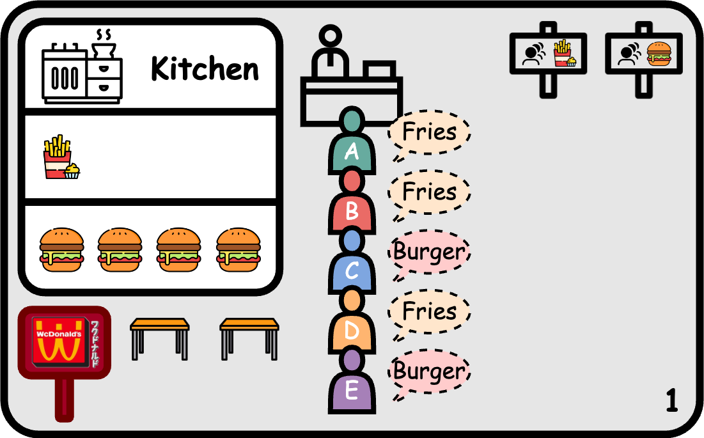
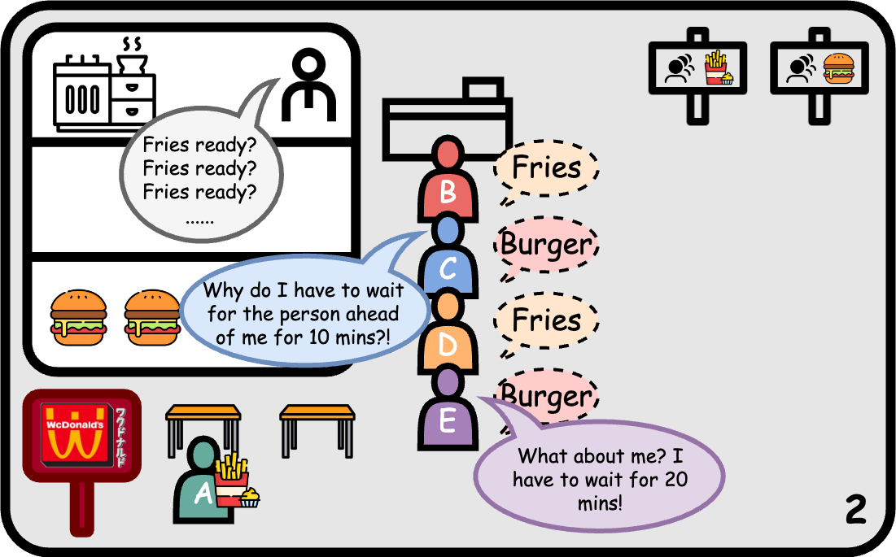
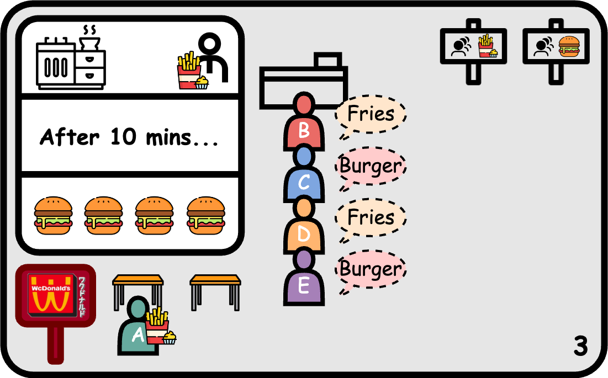
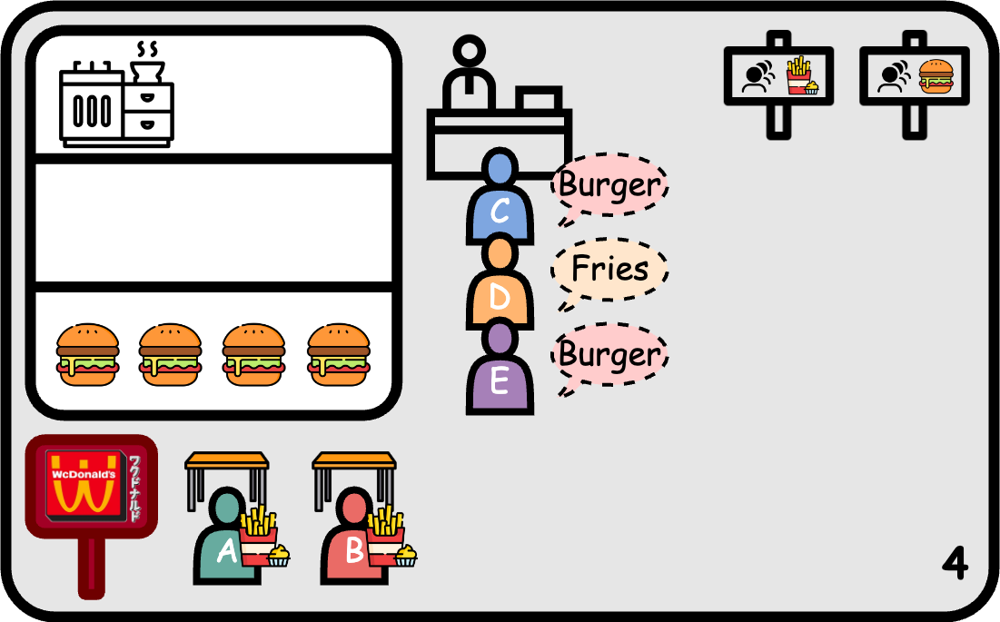
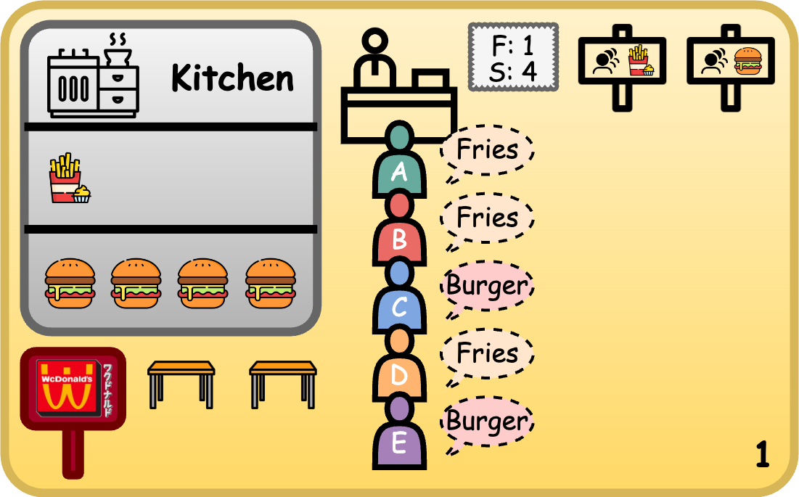
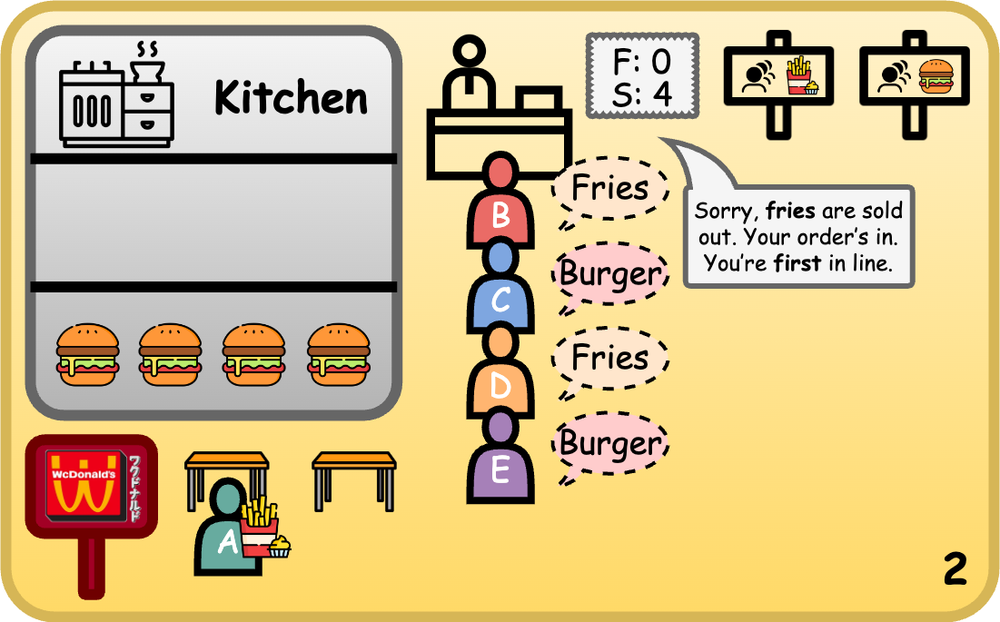
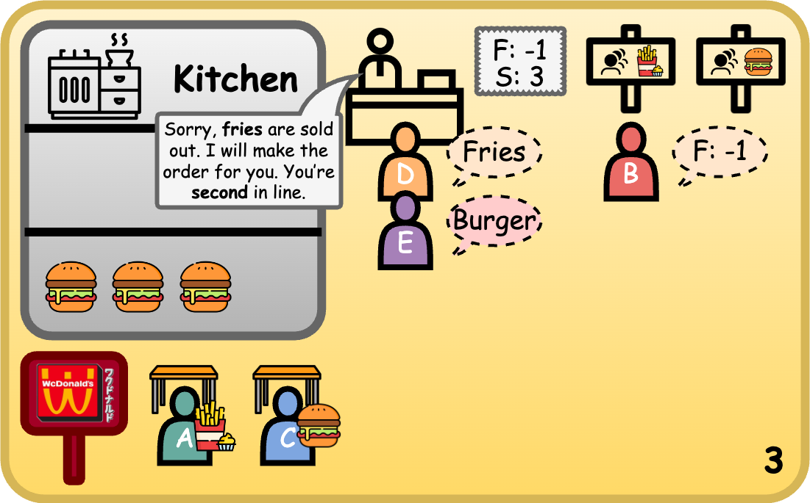
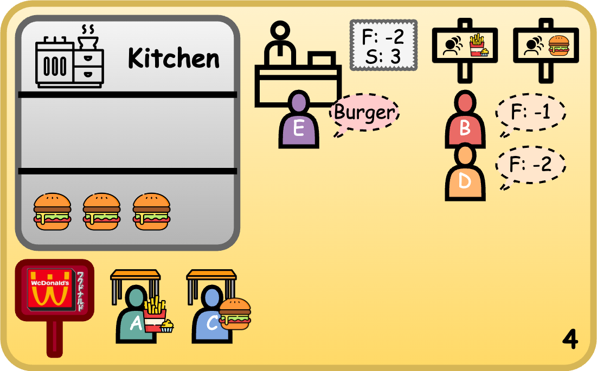
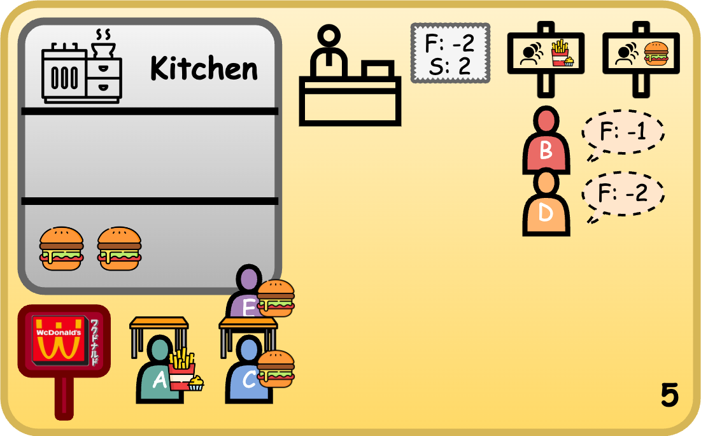
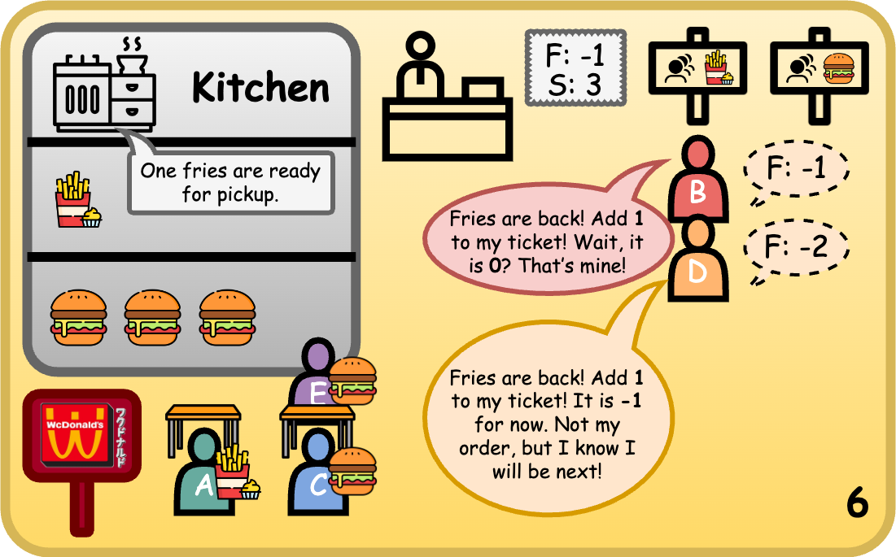

## COMP2017 2026 S1 Week 12 Tutorial A

<table><tbody>
  <tr><td><b>Tutor</b></td><td>Hao Ren</td></tr>
  <tr><td><b>Email</b></td><td><a href="hao.ren@sydney.edu.au">hao.ren@sydney.edu.au</a></td></tr>
</tbody></table>

[TOC]

---

### A.1 Synchronisation

Shared memory allows two processes to access the same memory, but it does **not** control timing. For example, a reader might try to read before the writer has written anything:

```text
Writer: writes data into shared memory
Reader: reads data from shared memory
```

Without synchronization, this can happen:

```text
Reader reads too early
Reader gets old or invalid data
```

A semaphore can fix this by making the reader wait until the writer says the data is ready.

---

### A.2 Semaphores

A **semaphore** is a synchronization tool used to control access to shared resources or to signal between processes/threads.

Think of a semaphore as a **counter**.

```text
P: sem_wait():
    If the counter is greater than 0, decrease it and continue.
    If the counter is 0, block and wait.

V: sem_post():
    Increase the counter.
    Wake up one waiting process/thread if there is one.
```

You might notice we use two "strange" character `P` (Wait) and `V` (Signal). Here is the resource about the naming: [Origins of P( ) and V( )](https://cs.nyu.edu/~yap/classes/os/resources/origin_of_PV.html).

#### A.2.1 Let's Design Semaphores Together: WcDonald's

The number of shared resources is very limited. Before a thread can access a shared resource, it must check whether the resource is currently being used by another thread. If the resource is unavailable, the thread must wait until it becomes available again.

To represent this, we can use a global variable to indicate whether the resource is available.

```c
// The number of available resources.
int S = 1;
```

When a thread accesses the shared resource, it needs to mark the resource as unavailable. Once the thread is finished, it also needs to mark the resource as available again.

Therefore, every thread should call `P()` to request access to the resource and `V()` to release the resource.

Let's design these two functions together.

```c
// Request the resource.
void P(void) {
    // If S <= 0, there are no available resources.
    // Wait until the resource becomes available.
    while (S <= 0);

    // S > 0, so the resource is available.
    // Mark the resource as in use.
    S--;
}

// Release the resource.
void V(void) {
    // Mark the resource as available again.
    S++;
}
```

However, there are still some problems with our design. Let's look at the following example.

In WcDonald's, suppose we have two types of shared resources: fries and burgers. Each type of resource may have multiple available instances. Customers who request these resources can be treated as threads.



Now, Customer `A` requests the last available order of fries. Customer `B` also wants to order fries. However, the cashier does not know how many orders of fries are still in stock. As a result, the cashier goes to the kitchen and repeatedly asks, "Are the fries ready yet?" for 10 minutes until another order of fries becomes available. Only then can the cashier bring the fries back to Customer `B`.

Now let's look at Customer `C`. Customer `C` only wants a burger, and we know that burgers are still in stock. However, Customer `C` still has to wait because the cashier is busy waiting for fries for Customer `B`.







This is extremely inefficient. The problem is that one waiting thread can block everyone behind it.

How can we improve this design?

Instead of making the cashier repeatedly check whether the fries are ready, what if the cashier takes the order first and gives the customer a number ticket? If there are currently no fries in stock, the customer can wait in a queue. Once the fries are ready, the cashier can notify the next customer in the queue.



Now we need to modify our data structure. Each semaphore should maintain both a counter and a waiting queue. The counter tells us how many resources are available, while the waiting queue stores the threads that are currently blocked.

Our `P()` and `V()` functions could look like this:

```c
// Pseudocode
typedef struct {
    int value;   // Number of available resources.
    Process/Thread *L;
} Semaphore;

// Request a resource.
void P(Semaphore *S) {
    S->value--;

    if (S->value < 0) {
        // No resource is available.
        // Block the current thread and put it into the waiting queue.
        block(S->L);
    }
}

// Release a resource.
void V(Semaphore *S) {
    S->value++;

    if (S->value <= 0) {
        // At least one thread is waiting.
        // Wake up all thread and add 1 to their value. Then, block those whose value still less than 0.
        wakeup(S->L);
    }
}
```



Now every customer has a known position in the waiting queue.







Once a resource becomes available because another thread or process releases it, the semaphore wakes up all waiting thread and add `1` (or more if multiple resources are released) to their values. Then, every thread will check if the current one is their order (if `value < 0` means no). Even no, they will at least know their updated position in the queue.

The important improvement is that waiting threads no longer need to repeatedly check whether the resource is available. Instead, they are blocked and placed into a queue. When the resource becomes available, the semaphore wakes up the appropriate waiting thread.



However, there are still one thing could be improved. Waking all waiting threads would create unnecessary contention and may cause another busy-wait-like problem.

A standard counting semaphore usually wakes one waiting thread per released resource. If multiple resources are released, multiple waiting threads may be woken up, one for each newly available resource. By using the data structure queue, we could figure out this problem.

```c
typedef struct {
    int value;   // Number of available resources.
    Queue *L;    // Queue of blocked threads.
} Semaphore;

// Request a resource.
void P(Semaphore *S) {
    S->value--;

    if (S->value < 0) {
        // No resource is available.
        // Block the current thread and put it into the waiting queue.
        block(S->L);
    }
}

// Release a resource.
void V(Semaphore *S) {
    S->value++;

    if (S->value <= 0) {
        // At least one thread is waiting.
        // Wake up one thread from the waiting queue.
        wakeup(S->L);
    }
}
```

Technical note: this is a simplified first design. In a real semaphore implementation, checking S and updating S must be done **atomically**; otherwise, multiple threads may still enter the critical section at the same time.

🎉 Congratulations! You have designed the semaphore mechanism! I am proud of you.


---

### A.3 

---

### A.4 

---

### A.5 

---

### A.6 Condition Variables
