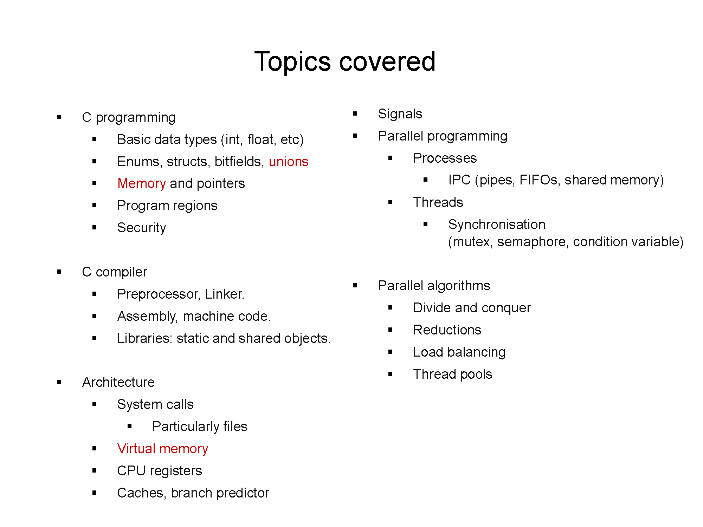

## COMP2017 2026 S1 Week 13 Tutorial B

<table><tbody>
  <tr><td><b>Tutor</b></td><td>Hao Ren</td></tr>
  <tr><td><b>Email</b></td><td><a href="hao.ren@sydney.edu.au">hao.ren@sydney.edu.au</a></td></tr>
</tbody></table>

- [COMP2017 2026 S1 Week 13 Tutorial B](#comp2017-2026-s1-week-13-tutorial-b)
  - [B.1 Revision Roadmap](#b1-revision-roadmap)
  - [B.2 Course Contents Quick Revision Notes](#b2-course-contents-quick-revision-notes)
  - [B.3 Exercises for Revision](#b3-exercises-for-revision)

---

### B.1 Revision Roadmap

> [!NOTE]
> On page 46 of the Week 13 lecture slides, Dr. Kroh presented a list of the topics we covered this semester. I hope everyone has a good understanding of this content. The following table serves as an extension of that slide:
> - `E` indicates extra exercises. Please refer to Section [B.3](#b3-exercises-for-revision) for more details.
> - `N` indicates revision notes. Please refer to Section [B.2](#b2-course-contents-quick-revision-notes) for more details.
> The topics in *italics* are what I **personally** consider highly important core concepts where students frequently make mistakes. You might want to spend more time on them. However, please note that I have no idea whether or not they will appear on the exam. They represent just a small part of our course!

<table border="1">
  <thead>
    <tr>
      <th>Chapter</th>
      <th>Topic / Subtopic</th>
      <th>Exercises / Notes</th>
    </tr>
  </thead>
  <tbody>
    <tr>
      <td rowspan="10"><strong> C Programming</strong></td>
      <td rowspan="2">Basic Data Types (<code>int</code>, <code>float</code>, <code>char</code>, Arrays,
        Arithmetic, <code>sizeof</code>)</td>
      <td>
        <strong>Exercises</strong>
        <ul>
          <li><a
              href="Week_13_Course_Revision_Exercises_Q.md#exercise-2-question-shared-memory-parallel-reduction-with-processes-and-semaphores">E2:
              Integer Array Sums and <code>long long</code> Totals</a></li>
          <li><a
              href="Week_13_Course_Revision_Exercises_Q.md#exercise-4-question-parallel-divide-and-conquer-with-reductions-and-load-balancing">E4:
              Numeric Reduction Values and Subarray Indices</a></li>
          <li><a
              href="Week_13_Course_Revision_Exercises_Q.md#exercise-6-question-shared-memory-fork-race-condition-and-virtual-memory-reasoning">E6:
              Integer Counters and Increment Races</a></li>
          <li><a
              href="Week_13_Course_Revision_Exercises_Q.md#exercise-7-question-cache-branch-prediction-and-parallel-matrix-reduction">E7:
              Matrix Indices and Numeric Sums</a></li>
          <li><a
              href="Week_13_Course_Revision_Exercises_Q.md#exercise-8-question-security-system-calls-and-file-copy-robustness">E8:
              Byte Buffers and File-Copy Counts</a></li>
          <li><a
              href="Week_13_Course_Revision_Exercises_Q.md#exercise-9-question-compilerlinker-static-symbols-shared-libraries-and-process-memory">E9:
              Static Integer Counter and Process Copies</a></li>
        </ul>
      </td>
    </tr>
    <tr>
      <td>
        <strong>Notes</strong>
        <ul>
          <li><a href="Week_13_Course_Revision_Notes.md#1-pointers-arrays-and-sizeof">N1: Arrays and
              <code>sizeof()</code></a></li>
          <li><a href="Week_13_Course_Revision_Notes.md#2-c-strings">N2: <code>char</code> Buffers and C
              Strings</a></li>
          <li><a href="Week_13_Course_Revision_Notes.md#7-bitwise-operators-and-flags">N7: Integer Masks and
              Bitwise Flags</a></li>
        </ul>
      </td>
    </tr>
    <tr>
      <td rowspan="2">Enums, Structs, Bitfields, Unions</td>
      <td>
        <strong>Exercises</strong>
        <ul>
          <li><a
              href="Week_13_Course_Revision_Exercises_Q.md#exercise-1-question-process-pool-with-pipes-select-signals-and-file-descriptors">E1:
              Job and Worker State Structs</a></li>
          <li><a
              href="Week_13_Course_Revision_Exercises_Q.md#exercise-2-question-shared-memory-parallel-reduction-with-processes-and-semaphores">E2:
              Shared-State Struct With Semaphore Field</a></li>
          <li><a
              href="Week_13_Course_Revision_Exercises_Q.md#exercise-3-question-thread-pool-with-condition-variables-task-queue-and-shutdown">E3:
              Thread-Pool and Task-Queue Structs</a></li>
          <li><a
              href="Week_13_Course_Revision_Exercises_Q.md#exercise-4-question-parallel-divide-and-conquer-with-reductions-and-load-balancing">E4:
              Task and Future Structs</a></li>
          <li><a
              href="Week_13_Course_Revision_Exercises_Q.md#exercise-6-question-shared-memory-fork-race-condition-and-virtual-memory-reasoning">E6:
              Shared Counter Struct</a></li>
          <li><a
              href="Week_13_Course_Revision_Exercises_Q.md#exercise-9-question-compilerlinker-static-symbols-shared-libraries-and-process-memory">E9:
              Static Symbols and File-Scope Data</a></li>
          <li><a
              href="Week_13_Course_Revision_Exercises_Q.md#exercise-10-question-cross-topic-debugging-race-deadlock-and-memory-lifetime">E10:
              Account and Job Structs With Locks</a></li>
        </ul>
      </td>
    </tr>
    <tr>
      <td>
        <strong>Notes</strong>
        <ul>
          <li><a href="Week_13_Course_Revision_Notes.md#6-structs-padding-and-unions">N6: Structs, Padding,
              and Unions</a></li>
          <li><a href="Week_13_Course_Revision_Notes.md#7-bitwise-operators-and-flags">N7: Bitfields-Style
              Flag Reasoning</a></li>
        </ul>
      </td>
    </tr>
    <tr>
      <td rowspan="2"><em>Memory and Pointers</em></td>
      <td>
        <strong>Exercises</strong>
        <ul>
          <li><a
              href="Week_13_Course_Revision_Exercises_Q.md#exercise-2-question-shared-memory-parallel-reduction-with-processes-and-semaphores">E2:
              <code>mmap()</code> Pointer To Shared State</a></li>
          <li><a
              href="Week_13_Course_Revision_Exercises_Q.md#exercise-3-question-thread-pool-with-condition-variables-task-queue-and-shutdown">E3:
              Task Arguments and Queue Ownership</a></li>
          <li><a
              href="Week_13_Course_Revision_Exercises_Q.md#exercise-4-question-parallel-divide-and-conquer-with-reductions-and-load-balancing">E4:
              Heap Task Lifetime and Future Pointers</a></li>
          <li><a
              href="Week_13_Course_Revision_Exercises_Q.md#exercise-6-question-shared-memory-fork-race-condition-and-virtual-memory-reasoning">E6:
              Shared Pointer From <code>mmap()</code></a></li>
          <li><a
              href="Week_13_Course_Revision_Exercises_Q.md#exercise-8-question-security-system-calls-and-file-copy-robustness">E8:
              Buffer Pointers in <code>read()</code>/<code>write()</code></a></li>
          <li><a
              href="Week_13_Course_Revision_Exercises_Q.md#exercise-9-question-compilerlinker-static-symbols-shared-libraries-and-process-memory">E9:
              Process Memory and Static Data</a></li>
          <li><a
              href="Week_13_Course_Revision_Exercises_Q.md#exercise-10-question-cross-topic-debugging-race-deadlock-and-memory-lifetime">E10:
              Thread Argument Lifetime</a></li>
        </ul>
      </td>
    </tr>
    <tr>
      <td>
        <strong>Notes</strong>
        <ul>
          <li><a href="Week_13_Course_Revision_Notes.md#1-pointers-arrays-and-sizeof">N1: Pointers, Arrays,
              and <code>sizeof()</code></a></li>
          <li><a href="Week_13_Course_Revision_Notes.md#2-c-strings">N2: String Memory and Null
              Terminators</a></li>
          <li><a href="Week_13_Course_Revision_Notes.md#3-stack-vs-heap">N3: Stack vs Heap Lifetime</a></li>
          <li><a href="Week_13_Course_Revision_Notes.md#4-malloc-calloc-realloc-free">N4:
              <code>malloc()</code>, <code>realloc()</code>, and <code>free()</code></a></li>
          <li><a href="Week_13_Course_Revision_Notes.md#5-linked-lists">N5: Pointer Rewiring in Linked
              Lists</a></li>
          <li><a href="Week_13_Course_Revision_Notes.md#6-structs-padding-and-unions">N6: Struct Pointers and
              Layout</a></li>
        </ul>
      </td>
    </tr>
    <tr>
      <td rowspan="2"><em>Program Regions: Text/Code, Static/Global, Heap, Stack, Shared Mappings</em></td>
      <td>
        <strong>Exercises</strong>
        <ul>
          <li><a
              href="Week_13_Course_Revision_Exercises_Q.md#exercise-6-question-shared-memory-fork-race-condition-and-virtual-memory-reasoning">E6:
              <code>fork()</code>, <code>mmap()</code>, and Copy-on-Write</a></li>
          <li><a
              href="Week_13_Course_Revision_Exercises_Q.md#exercise-9-question-compilerlinker-static-symbols-shared-libraries-and-process-memory">E9:
              Code, Static Data, Stack, Heap, and Libraries</a></li>
        </ul>
      </td>
    </tr>
    <tr>
      <td>
        <strong>Notes</strong>
        <ul>
          <li><a href="Week_13_Course_Revision_Notes.md#3-stack-vs-heap">N3: Stack vs Heap</a></li>
          <li><a href="Week_13_Course_Revision_Notes.md#4-malloc-calloc-realloc-free">N4: Heap Allocation and
              Freeing</a></li>
          <li><a href="Week_13_Course_Revision_Notes.md#11-fork-wait-waitpid-and-exec">N11: Process Image
              After <code>fork()</code>/<code>exec()</code></a></li>
          <li><a href="Week_13_Course_Revision_Notes.md#16-shared-memory-with-mmap">N16: Shared Mappings With
              <code>mmap()</code></a></li>
        </ul>
      </td>
    </tr>
    <tr>
      <td rowspan="2">Security</td>
      <td>
        <strong>Exercises</strong>
        <ul>
          <li><a
              href="Week_13_Course_Revision_Exercises_Q.md#exercise-5-question-signal-controlled-exec-runner-with-timeout">E5:
              Signal-Safe Timeout Cleanup</a></li>
          <li><a
              href="Week_13_Course_Revision_Exercises_Q.md#exercise-8-question-security-system-calls-and-file-copy-robustness">E8:
              Secure File Copy and Symlink Resistance</a></li>
          <li><a
              href="Week_13_Course_Revision_Exercises_Q.md#exercise-10-question-cross-topic-debugging-race-deadlock-and-memory-lifetime">E10:
              Race, Deadlock, and Lifetime Bugs</a></li>
        </ul>
      </td>
    </tr>
    <tr>
      <td>
        <strong>Notes</strong>
        <ul>
          <li><a href="Week_13_Course_Revision_Notes.md#2-c-strings">N2: Buffer Overflow and String Safety</a>
          </li>
          <li><a href="Week_13_Course_Revision_Notes.md#4-malloc-calloc-realloc-free">N4: Memory Leaks and
              Use-After-Free</a></li>
          <li><a href="Week_13_Course_Revision_Notes.md#10-file-descriptors-open-read-write-close">N10:
              File-Descriptor Error Handling</a></li>
          <li><a href="Week_13_Course_Revision_Notes.md#12-signals-struct-sigaction-and-sigaction">N12:
              Async-Signal Safety</a></li>
          <li><a href="Week_13_Course_Revision_Notes.md#20-deadlocks">N20: Deadlock Prevention</a></li>
        </ul>
      </td>
    </tr>
    <tr>
      <td rowspan="5"><strong> C Compiler</strong></td>
      <td rowspan="2">Preprocessor and Linker</td>
      <td>
        <strong>Exercises</strong>
        <ul>
          <li><a
              href="Week_13_Course_Revision_Exercises_Q.md#exercise-9-question-compilerlinker-static-symbols-shared-libraries-and-process-memory">E9:
              Linker Symbols and Translation Units</a></li>
        </ul>
      </td>
    </tr>
    <tr>
      <td>
        <strong>Notes</strong>
        <ul>
          <li><a href="Week_13_Course_Revision_Notes.md#0-how-to-compile-during-revision">N0: Compile Commands
              and Flags</a></li>
        </ul>
      </td>
    </tr>
    <tr>
      <td>Assembly and Machine Code</td>
      <td>
        <strong>Exercises</strong>
        <ul>
          <li><a
              href="Week_13_Course_Revision_Exercises_Q.md#exercise-9-question-compilerlinker-static-symbols-shared-libraries-and-process-memory">E9:
              Compiled Symbols and Process Image</a></li>
          <li><a
              href="Week_13_Course_Revision_Exercises_Q.md#exercise-7-question-cache-branch-prediction-and-parallel-matrix-reduction">E7:
              Hardware-Level Cache and Branch Effects</a></li>
        </ul>
      </td>
    </tr>
      <td rowspan="2">Libraries: Static and Shared Objects</td>
      <td>
        <strong>Exercises</strong>
        <ul>
          <li><a
              href="Week_13_Course_Revision_Exercises_Q.md#exercise-9-question-compilerlinker-static-symbols-shared-libraries-and-process-memory">E9:
              Static Libraries and Shared Objects</a></li>
        </ul>
      </td>
    </tr>
    <tr>
      <td>
        <strong>Notes</strong>
        <ul>
          <li><a href="Week_13_Course_Revision_Notes.md#0-how-to-compile-during-revision">N0: Compile/Link
              Command Context</a></li>
        </ul>
      </td>
    </tr>
    <tr>
      <td rowspan="8"><strong> Architecture</strong></td>
      <td rowspan="2"><em>System Calls</em></td>
      <td>
        <strong>Exercises</strong>
        <ul>
          <li><a
              href="Week_13_Course_Revision_Exercises_Q.md#exercise-1-question-process-pool-with-pipes-select-signals-and-file-descriptors">E1:
              <code>fork()</code>, <code>pipe()</code>, <code>select()</code>, and
              <code>waitpid()</code></a></li>
          <li><a
              href="Week_13_Course_Revision_Exercises_Q.md#exercise-2-question-shared-memory-parallel-reduction-with-processes-and-semaphores">E2:
              <code>fork()</code>, <code>mmap()</code>, <code>sem_wait()</code></a></li>
          <li><a
              href="Week_13_Course_Revision_Exercises_Q.md#exercise-5-question-signal-controlled-exec-runner-with-timeout">E5:
              <code>fork()</code>, <code>execvp()</code>, <code>alarm()</code>, <code>kill()</code></a>
          </li>
          <li><a
              href="Week_13_Course_Revision_Exercises_Q.md#exercise-6-question-shared-memory-fork-race-condition-and-virtual-memory-reasoning">E6:
              <code>mmap()</code>, <code>fork()</code>, and <code>wait()</code></a></li>
          <li><a
              href="Week_13_Course_Revision_Exercises_Q.md#exercise-8-question-security-system-calls-and-file-copy-robustness">E8:
              <code>open()</code>, <code>read()</code>, <code>write()</code>, <code>close()</code></a>
          </li>
          <li><a
              href="Week_13_Course_Revision_Exercises_Q.md#exercise-9-question-compilerlinker-static-symbols-shared-libraries-and-process-memory">E9:
              <code>fork()</code> and Process Memory</a></li>
        </ul>
      </td>
    </tr>
    <tr>
      <td>
        <strong>Notes</strong>
        <ul>
          <li><a href="Week_13_Course_Revision_Notes.md#10-file-descriptors-open-read-write-close">N10:
              File-Descriptor System Calls</a></li>
          <li><a href="Week_13_Course_Revision_Notes.md#11-fork-wait-waitpid-and-exec">N11: Process System
              Calls</a></li>
          <li><a href="Week_13_Course_Revision_Notes.md#12-signals-struct-sigaction-and-sigaction">N12: Signal
              System Calls</a></li>
          <li><a href="Week_13_Course_Revision_Notes.md#13-pipes-and-dup2">N13: <code>pipe()</code> and
              <code>dup2()</code></a></li>
          <li><a href="Week_13_Course_Revision_Notes.md#15-non-blocking-io-select-poll-and-epoll">N15:
              Readiness I/O System Calls</a></li>
          <li><a href="Week_13_Course_Revision_Notes.md#16-shared-memory-with-mmap">N16: <code>mmap()</code>
              Shared Memory</a></li>
        </ul>
      </td>
    </tr>
    <tr>
      <td rowspan="2"><em>Particularly Files</em></td>
      <td>
        <strong>Exercises</strong>
        <ul>
          <li><a
              href="Week_13_Course_Revision_Exercises_Q.md#exercise-1-question-process-pool-with-pipes-select-signals-and-file-descriptors">E1:
              Pipe File Descriptors in Process Pool</a></li>
          <li><a
              href="Week_13_Course_Revision_Exercises_Q.md#exercise-8-question-security-system-calls-and-file-copy-robustness">E8:
              Robust File Copy With System Calls</a></li>
        </ul>
      </td>
    </tr>
    <tr>
      <td>
        <strong>Notes</strong>
        <ul>
          <li><a href="Week_13_Course_Revision_Notes.md#9-file--stream-io">N9: <code>FILE *</code> Stream
              I/O</a></li>
          <li><a href="Week_13_Course_Revision_Notes.md#10-file-descriptors-open-read-write-close">N10: Raw
              File Descriptors</a></li>
          <li><a href="Week_13_Course_Revision_Notes.md#13-pipes-and-dup2">N13: Pipes As File Descriptors</a>
          </li>
          <li><a href="Week_13_Course_Revision_Notes.md#14-file-descriptor-table-mental-model">N14: File
              Descriptor Tables</a></li>
          <li><a href="Week_13_Course_Revision_Notes.md#15-non-blocking-io-select-poll-and-epoll">N15:
              Readiness-Based I/O</a></li>
        </ul>
      </td>
    </tr>
    <tr>
      <td rowspan="2"><em>Virtual Memory</em></td>
      <td>
        <strong>Exercises</strong>
        <ul>
          <li><a
              href="Week_13_Course_Revision_Exercises_Q.md#exercise-2-question-shared-memory-parallel-reduction-with-processes-and-semaphores">E2:
              Process-Shared <code>mmap()</code> Reduction</a></li>
          <li><a
              href="Week_13_Course_Revision_Exercises_Q.md#exercise-6-question-shared-memory-fork-race-condition-and-virtual-memory-reasoning">E6:
              Copy-on-Write and Shared Mappings</a></li>
          <li><a
              href="Week_13_Course_Revision_Exercises_Q.md#exercise-9-question-compilerlinker-static-symbols-shared-libraries-and-process-memory">E9:
              Process Address-Space Regions</a></li>
        </ul>
      </td>
    </tr>
    <tr>
      <td>
        <strong>Notes</strong>
        <ul>
          <li><a href="Week_13_Course_Revision_Notes.md#3-stack-vs-heap">N3: Stack and Heap Regions</a></li>
          <li><a href="Week_13_Course_Revision_Notes.md#11-fork-wait-waitpid-and-exec">N11: Address Spaces
              After <code>fork()</code>/<code>exec()</code></a></li>
          <li><a href="Week_13_Course_Revision_Notes.md#16-shared-memory-with-mmap">N16: Shared Virtual
              Mappings</a></li>
        </ul>
      </td>
    </tr>
    <tr>
      <td>CPU Registers</td>
      <td>
        <strong>Exercises</strong>
        <ul>
          <li><a
              href="Week_13_Course_Revision_Exercises_Q.md#exercise-5-question-signal-controlled-exec-runner-with-timeout">E5:
              Signal Interruption and Process Execution State</a></li>
          <li><a
              href="Week_13_Course_Revision_Exercises_Q.md#exercise-9-question-compilerlinker-static-symbols-shared-libraries-and-process-memory">E9:
              Process Image and Compiled Code State</a></li>
        </ul>
      </td>
    </tr>
    <tr>
      <td>Caches and Branch Predictor</td>
      <td>
        <strong>Exercises</strong>
        <ul>
          <li><a
              href="Week_13_Course_Revision_Exercises_Q.md#exercise-2-question-shared-memory-parallel-reduction-with-processes-and-semaphores">E2:
              False Sharing in Partial Sums</a></li>
          <li><a
              href="Week_13_Course_Revision_Exercises_Q.md#exercise-4-question-parallel-divide-and-conquer-with-reductions-and-load-balancing">E4:
              Task Granularity and Overhead</a></li>
          <li><a
              href="Week_13_Course_Revision_Exercises_Q.md#exercise-7-question-cache-branch-prediction-and-parallel-matrix-reduction">E7:
              Cache Locality and Branch Prediction</a></li>
        </ul>
      </td>
    </tr>
    <tr>
      <td rowspan="4"><strong> Signals</strong></td>
      <td rowspan="2"><em>Signal Handlers, <code>sigaction()</code>, <code>kill()</code>,</em> <code>alarm()</code>,
        Async-Signal Safety</td>
      <td>
        <strong>Exercises</strong>
        <ul>
          <li><a
              href="Week_13_Course_Revision_Exercises_Q.md#exercise-1-question-process-pool-with-pipes-select-signals-and-file-descriptors">E1:
              <code>SIGINT</code> Cleanup Flag</a></li>
          <li><a
              href="Week_13_Course_Revision_Exercises_Q.md#exercise-5-question-signal-controlled-exec-runner-with-timeout">E5:
              <code>SIGALRM</code>, <code>SIGTERM</code>, and <code>SIGKILL</code></a></li>
        </ul>
      </td>
    </tr>
    <tr>
      <td>
        <strong>Notes</strong>
        <ul>
          <li><a href="Week_13_Course_Revision_Notes.md#12-signals-struct-sigaction-and-sigaction">N12: Signal
              Handlers and <code>sigaction()</code></a></li>
          <li><a href="Week_13_Course_Revision_Notes.md#11-fork-wait-waitpid-and-exec">N11: Child Status With
              <code>waitpid()</code></a></li>
        </ul>
      </td>
    </tr>
    <tr>
      <td rowspan="2">Signal-Based Process Control</td>
      <td>
        <strong>Exercises</strong>
        <ul>
          <li><a
              href="Week_13_Course_Revision_Exercises_Q.md#exercise-5-question-signal-controlled-exec-runner-with-timeout">E5:
              Timeout-Controlled Child Process</a></li>
        </ul>
      </td>
    </tr>
    <tr>
      <td>
        <strong>Notes</strong>
        <ul>
          <li><a href="Week_13_Course_Revision_Notes.md#12-signals-struct-sigaction-and-sigaction">N12: Signal
              Delivery and Handlers</a></li>
          <li><a href="Week_13_Course_Revision_Notes.md#11-fork-wait-waitpid-and-exec">N11: Parent-Child
              Process Control</a></li>
        </ul>
      </td>
    </tr>
    <tr>
      <td rowspan="17"><strong> Parallel Programming</strong></td>
      <td rowspan="2"><em>Processes</em></td>
      <td>
        <strong>Exercises</strong>
        <ul>
          <li><a
              href="Week_13_Course_Revision_Exercises_Q.md#exercise-1-question-process-pool-with-pipes-select-signals-and-file-descriptors">E1:
              Worker Process Pool</a></li>
          <li><a
              href="Week_13_Course_Revision_Exercises_Q.md#exercise-2-question-shared-memory-parallel-reduction-with-processes-and-semaphores">E2:
              Process-Based Parallel Reduction</a></li>
          <li><a
              href="Week_13_Course_Revision_Exercises_Q.md#exercise-5-question-signal-controlled-exec-runner-with-timeout">E5:
              Child Process With <code>exec()</code></a></li>
          <li><a
              href="Week_13_Course_Revision_Exercises_Q.md#exercise-6-question-shared-memory-fork-race-condition-and-virtual-memory-reasoning">E6:
              Forked Processes and Shared Counter</a></li>
          <li><a
              href="Week_13_Course_Revision_Exercises_Q.md#exercise-9-question-compilerlinker-static-symbols-shared-libraries-and-process-memory">E9:
              Process Copies of Static Data</a></li>
        </ul>
      </td>
    </tr>
    <tr>
      <td>
        <strong>Notes</strong>
        <ul>
          <li><a href="Week_13_Course_Revision_Notes.md#11-fork-wait-waitpid-and-exec">N11:
              <code>fork()</code>, <code>waitpid()</code>, and <code>exec()</code></a></li>
        </ul>
      </td>
    </tr>
    <tr>
      <td rowspan="2"><em>IPC: Pipes</em></td>
      <td>
        <strong>Exercises</strong>
        <ul>
          <li><a
              href="Week_13_Course_Revision_Exercises_Q.md#exercise-1-question-process-pool-with-pipes-select-signals-and-file-descriptors">E1:
              Bidirectional Parent-Worker Pipes</a></li>
        </ul>
      </td>
    </tr>
    <tr>
      <td>
        <strong>Notes</strong>
        <ul>
          <li><a href="Week_13_Course_Revision_Notes.md#13-pipes-and-dup2">N13: Pipes and
              <code>dup2()</code></a></li>
          <li><a href="Week_13_Course_Revision_Notes.md#14-file-descriptor-table-mental-model">N14: File
              Descriptor Table After <code>fork()</code></a></li>
          <li><a href="Week_13_Course_Revision_Notes.md#15-non-blocking-io-select-poll-and-epoll">N15:
              <code>select()</code> Over Pipe Descriptors</a></li>
        </ul>
      </td>
    </tr>
    <tr>
      <td>IPC: FIFOs</td>
      <td>
        <strong>Notes</strong>
        <ul>
          <li><a href="Week_13_Course_Revision_Notes.md#10-file-descriptors-open-read-write-close">N10:
              FIFO-Style <code>open()</code>/<code>read()</code>/<code>write()</code> Reasoning</a></li>
          <li><a href="Week_13_Course_Revision_Notes.md#13-pipes-and-dup2">N13: Pipe Byte-Stream Model</a>
          </li>
        </ul>
      </td>
    </tr>
    <tr>
      <td rowspan="2">IPC: Shared Memory</td>
      <td>
        <strong>Exercises</strong>
        <ul>
          <li><a
              href="Week_13_Course_Revision_Exercises_Q.md#exercise-2-question-shared-memory-parallel-reduction-with-processes-and-semaphores">E2:
              Shared-Memory Reduction With Semaphores</a></li>
          <li><a
              href="Week_13_Course_Revision_Exercises_Q.md#exercise-6-question-shared-memory-fork-race-condition-and-virtual-memory-reasoning">E6:
              Shared Counter With <code>mmap()</code></a></li>
        </ul>
      </td>
    </tr>
    <tr>
      <td>
        <strong>Notes</strong>
        <ul>
          <li><a href="Week_13_Course_Revision_Notes.md#16-shared-memory-with-mmap">N16: Shared Memory With
              <code>mmap()</code></a></li>
          <li><a href="Week_13_Course_Revision_Notes.md#21-semaphores">N21: Synchronising Shared Memory With
              Semaphores</a></li>
        </ul>
      </td>
    </tr>
    <tr>
      <td rowspan="2"><em>Threads</em></td>
      <td>
        <strong>Exercises</strong>
        <ul>
          <li><a
              href="Week_13_Course_Revision_Exercises_Q.md#exercise-3-question-thread-pool-with-condition-variables-task-queue-and-shutdown">E3:
              Worker Threads in A Thread Pool</a></li>
          <li><a
              href="Week_13_Course_Revision_Exercises_Q.md#exercise-4-question-parallel-divide-and-conquer-with-reductions-and-load-balancing">E4:
              Thread-Pool Subtasks</a></li>
          <li><a
              href="Week_13_Course_Revision_Exercises_Q.md#exercise-7-question-cache-branch-prediction-and-parallel-matrix-reduction">E7:
              Parallel Matrix Worker Threads</a></li>
          <li><a
              href="Week_13_Course_Revision_Exercises_Q.md#exercise-10-question-cross-topic-debugging-race-deadlock-and-memory-lifetime">E10:
              Thread Argument Lifetime</a></li>
        </ul>
      </td>
    </tr>
    <tr>
      <td>
        <strong>Notes</strong>
        <ul>
          <li><a href="Week_13_Course_Revision_Notes.md#17-pthread_create-and-pthread_join">N17:
              <code>pthread_create()</code> and <code>pthread_join()</code></a></li>
        </ul>
      </td>
    </tr>
    <tr>
      <td rowspan="2"><em>Synchronisation: Mutex</em></td>
      <td>
        <strong>Exercises</strong>
        <ul>
          <li><a
              href="Week_13_Course_Revision_Exercises_Q.md#exercise-3-question-thread-pool-with-condition-variables-task-queue-and-shutdown">E3:
              Mutex-Protected Task Queue</a></li>
          <li><a
              href="Week_13_Course_Revision_Exercises_Q.md#exercise-7-question-cache-branch-prediction-and-parallel-matrix-reduction">E7:
              Avoiding Global-Sum Mutex Bottleneck</a></li>
          <li><a
              href="Week_13_Course_Revision_Exercises_Q.md#exercise-10-question-cross-topic-debugging-race-deadlock-and-memory-lifetime">E10:
              Account Locks and Transfer Invariant</a></li>
        </ul>
      </td>
    </tr>
    <tr>
      <td>
        <strong>Notes</strong>
        <ul>
          <li><a href="Week_13_Course_Revision_Notes.md#18-race-conditions-and-mutexes">N18: Race Conditions
              and Mutexes</a></li>
          <li><a href="Week_13_Course_Revision_Notes.md#20-deadlocks">N20: Lock Ordering and Deadlock</a></li>
        </ul>
      </td>
    </tr>
    <tr>
      <td rowspan="2">Synchronisation: Semaphore</td>
      <td>
        <strong>Exercises</strong>
        <ul>
          <li><a
              href="Week_13_Course_Revision_Exercises_Q.md#exercise-2-question-shared-memory-parallel-reduction-with-processes-and-semaphores">E2:
              Process-Shared Semaphore For Reduction</a></li>
          <li><a
              href="Week_13_Course_Revision_Exercises_Q.md#exercise-6-question-shared-memory-fork-race-condition-and-virtual-memory-reasoning">E6:
              Semaphore-Protected Shared Counter</a></li>
        </ul>
      </td>
    </tr>
    <tr>
      <td>
        <strong>Notes</strong>
        <ul>
          <li><a href="Week_13_Course_Revision_Notes.md#21-semaphores">N21: <code>sem_wait()</code> and
              <code>sem_post()</code></a></li>
          <li><a href="Week_13_Course_Revision_Notes.md#16-shared-memory-with-mmap">N16: Process-Shared Memory
              Requiring Synchronization</a></li>
        </ul>
      </td>
    </tr>
    <tr>
      <td rowspan="2">Synchronisation: Condition Variable</td>
      <td>
        <strong>Exercises</strong>
        <ul>
          <li><a
              href="Week_13_Course_Revision_Exercises_Q.md#exercise-3-question-thread-pool-with-condition-variables-task-queue-and-shutdown">E3:
              <code>not_empty</code>, <code>not_full</code>, and Shutdown Predicates</a></li>
          <li><a
              href="Week_13_Course_Revision_Exercises_Q.md#exercise-4-question-parallel-divide-and-conquer-with-reductions-and-load-balancing">E4:
              Future Completion With Condition Variables</a></li>
        </ul>
      </td>
    </tr>
    <tr>
      <td>
        <strong>Notes</strong>
        <ul>
          <li><a href="Week_13_Course_Revision_Notes.md#22-condition-variables">N22: Condition Variables and
              Predicate Loops</a></li>
        </ul>
      </td>
    </tr>
    <tr>
      <td rowspan="2">Deadlock</td>
      <td>
        <strong>Exercises</strong>
        <ul>
          <li><a
              href="Week_13_Course_Revision_Exercises_Q.md#exercise-3-question-thread-pool-with-condition-variables-task-queue-and-shutdown">E3:
              Shutdown and Queue-Wait Deadlock Risks</a></li>
          <li><a
              href="Week_13_Course_Revision_Exercises_Q.md#exercise-4-question-parallel-divide-and-conquer-with-reductions-and-load-balancing">E4:
              Nested Future/Thread-Pool Deadlock Risk</a></li>
          <li><a
              href="Week_13_Course_Revision_Exercises_Q.md#exercise-10-question-cross-topic-debugging-race-deadlock-and-memory-lifetime">E10:
              Inconsistent Account Lock Ordering</a></li>
        </ul>
      </td>
    </tr>
    <tr>
      <td>
        <strong>Notes</strong>
        <ul>
          <li><a href="Week_13_Course_Revision_Notes.md#20-deadlocks">N20: Deadlock Conditions and
              Prevention</a></li>
          <li><a href="Week_13_Course_Revision_Notes.md#18-race-conditions-and-mutexes">N18: Mutex-Protected
              Critical Sections</a></li>
        </ul>
      </td>
    </tr>
    <tr>
      <td rowspan="8"><strong> Parallel Algorithms</strong></td>
      <td rowspan="2">Divide and Conquer</td>
      <td>
        <strong>Exercises</strong>
        <ul>
          <li><a
              href="Week_13_Course_Revision_Exercises_Q.md#exercise-4-question-parallel-divide-and-conquer-with-reductions-and-load-balancing">E4:
              Divide-and-Conquer Split and Combine</a></li>
        </ul>
      </td>
    </tr>
    <tr>
      <td>
        <strong>Notes</strong>
        <ul>
          <li><a href="Week_13_Course_Revision_Notes.md#23-recursion-and-thread-overhead">N23: Recursion and
              Thread Overhead</a></li>
        </ul>
      </td>
    </tr>
    <tr>
      <td rowspan="2">Reductions</td>
      <td>
        <strong>Exercises</strong>
        <ul>
          <li><a
              href="Week_13_Course_Revision_Exercises_Q.md#exercise-2-question-shared-memory-parallel-reduction-with-processes-and-semaphores">E2:
              Process-Local Partial Sums</a></li>
          <li><a
              href="Week_13_Course_Revision_Exercises_Q.md#exercise-4-question-parallel-divide-and-conquer-with-reductions-and-load-balancing">E4:
              Recursive Reduction Combine</a></li>
          <li><a
              href="Week_13_Course_Revision_Exercises_Q.md#exercise-6-question-shared-memory-fork-race-condition-and-virtual-memory-reasoning">E6:
              Reducing Increments Into One Shared Update</a></li>
          <li><a
              href="Week_13_Course_Revision_Exercises_Q.md#exercise-7-question-cache-branch-prediction-and-parallel-matrix-reduction">E7:
              Per-Thread Matrix Partial Sums</a></li>
        </ul>
      </td>
    </tr>
    <tr>
      <td>
        <strong>Notes</strong>
        <ul>
          <li><a href="Week_13_Course_Revision_Notes.md#21-semaphores">N21: Synchronization For Reduction
              Boundaries</a></li>
          <li><a href="Week_13_Course_Revision_Notes.md#18-race-conditions-and-mutexes">N18: Avoiding
              Shared-Sum Races</a></li>
          <li><a href="Week_13_Course_Revision_Notes.md#23-recursion-and-thread-overhead">N23: Recursion
              Overhead in Reductions</a></li>
        </ul>
      </td>
    </tr>
    <tr>
      <td rowspan="2">Load Balancing</td>
      <td>
        <strong>Exercises</strong>
        <ul>
          <li><a
              href="Week_13_Course_Revision_Exercises_Q.md#exercise-1-question-process-pool-with-pipes-select-signals-and-file-descriptors">E1:
              Dynamic Assignment To Free Workers</a></li>
          <li><a
              href="Week_13_Course_Revision_Exercises_Q.md#exercise-2-question-shared-memory-parallel-reduction-with-processes-and-semaphores">E2:
              Balanced Process Chunks</a></li>
          <li><a
              href="Week_13_Course_Revision_Exercises_Q.md#exercise-3-question-thread-pool-with-condition-variables-task-queue-and-shutdown">E3:
              Bounded Task Queue Load Distribution</a></li>
          <li><a
              href="Week_13_Course_Revision_Exercises_Q.md#exercise-4-question-parallel-divide-and-conquer-with-reductions-and-load-balancing">E4:
              Recursive Subtask Balancing</a></li>
          <li><a
              href="Week_13_Course_Revision_Exercises_Q.md#exercise-7-question-cache-branch-prediction-and-parallel-matrix-reduction">E7:
              Row-Block Partitioning</a></li>
        </ul>
      </td>
    </tr>
    <tr>
      <td>
        <strong>Notes</strong>
        <ul>
          <li><a href="Week_13_Course_Revision_Notes.md#17-pthread_create-and-pthread_join">N17: Worker Thread
              Creation and Joining</a></li>
          <li><a href="Week_13_Course_Revision_Notes.md#21-semaphores">N21: Counting Available
              Work/Resources</a></li>
          <li><a href="Week_13_Course_Revision_Notes.md#22-condition-variables">N22: Sleeping Until Work Is
              Available</a></li>
          <li><a href="Week_13_Course_Revision_Notes.md#23-recursion-and-thread-overhead">N23: Task Overhead
              and Recursion Depth</a></li>
        </ul>
      </td>
    </tr>
    <tr>
      <td rowspan="2"><em>Thread Pools</em></td>
      <td>
        <strong>Exercises</strong>
        <ul>
          <li><a
              href="Week_13_Course_Revision_Exercises_Q.md#exercise-3-question-thread-pool-with-condition-variables-task-queue-and-shutdown">E3:
              Full Thread-Pool Implementation</a></li>
          <li><a
              href="Week_13_Course_Revision_Exercises_Q.md#exercise-4-question-parallel-divide-and-conquer-with-reductions-and-load-balancing">E4:
              Thread-Pool Use in Recursive Reduction</a></li>
        </ul>
      </td>
    </tr>
    <tr>
      <td>
        <strong>Notes</strong>
        <ul>
          <li><a href="Week_13_Course_Revision_Notes.md#17-pthread_create-and-pthread_join">N17: Worker Thread
              Lifecycle</a></li>
          <li><a href="Week_13_Course_Revision_Notes.md#18-race-conditions-and-mutexes">N18: Protecting The
              Task Queue</a></li>
          <li><a href="Week_13_Course_Revision_Notes.md#22-condition-variables">N22: Work-Available and
              Space-Available Predicates</a></li>
          <li><a href="Week_13_Course_Revision_Notes.md#23-recursion-and-thread-overhead">N23: Avoiding One
              Thread Per Recursive Call</a></li>
        </ul>
      </td>
    </tr>
  </tbody>
</table>

---

### B.2 Course Contents Quick Revision Notes

> [!TIP]
> This document provides a **brief** recap of the core content we have learned this semester. It is intended to help you revise; however, due to length limitations, some important content is not included. You can use it as a **roadmap**. If you believe you are an expert on a particular chapter, you can safely skip it. If you want a more detailed explanation, please refer to our notes from Weeks 1 to 12.
>
> **[Course Revision Notes/Cheetsheets](Week_13_Course_Revision_Notes.md)**

---

### B.3 Exercises for Revision

For contents in week 1 to week 7, I would recommend making sure you are comfortable with the core C concepts, especially pointers, memory allocation, structs, arrays, strings, file I/O, debugging, and Makefiles. These foundations are very important because many of the later topics rely heavily on them.

And for the systems programming topics from Week 8 to week 12, I would prioritise the following tutorial exercises:

- **Week 8**
  - **Parallel Search**: basic use of multiple processes.
  - **SIGCHLD**: usage of `sigaction()` and signal handling.
- **Week 9**
  - **Bash Simulator II**: comprehensive use of command-line arguments, multiple processes using `fork()` and `exec()`, and pipelines.
  - **E-Toll**: usage of `epoll()`.
  - **Word Count II**: shared memory.
- **Week 10**
  - **Summation**: basic usage of threads.
  - **JOEY DOESN'T SHARE FOOD**: basic usage of mutexes.
- **Week 11**
  - **DNS Cache I** & **DNS Cache II**: comprehensive usage of threads and locks.
  - **Dining Philosophers**: classic mutex usage and avoiding deadlock.
  - **Dining Semaphore**: similar to Dining Philosophers, but using semaphores.
- **Week 12**
  - **Fibonacci I, II, and III**: recursion and practical thread usage for optimisation.

> [!TIP]
> *In addition, the following exercises are more cross-topic and are provided for revision. I would say some of them are **harder than** the problems you will meet during the exam. This means you shouldn't feel stressed if you experience any challenges when trying to solve them! :)*
>
> **[Extra Course Revision Exercises (Advanced)](Week_13_Course_Revision_Exercises_Q.md)**
> - [Exercise 1 Question: Process Pool with Pipes, `select()`, Signals, and File Descriptors](Week_13_Course_Revision_Exercises_Q.md#exercise-1-question-process-pool-with-pipes-select-signals-and-file-descriptors)
> - [Exercise 2 Question: Shared-Memory Parallel Reduction with Processes and Semaphores](Week_13_Course_Revision_Exercises_Q.md#exercise-2-question-shared-memory-parallel-reduction-with-processes-and-semaphores)
> - [Exercise 3 Question: Thread Pool with Condition Variables, Task Queue, and Shutdown](Week_13_Course_Revision_Exercises_Q.md#exercise-3-question-thread-pool-with-condition-variables-task-queue-and-shutdown)
> - [Exercise 4 Question: Parallel Divide-and-Conquer with Reductions and Load Balancing](Week_13_Course_Revision_Exercises_Q.md#exercise-4-question-parallel-divide-and-conquer-with-reductions-and-load-balancing)
> - [Exercise 5 Question: Signal-Controlled `exec()` Runner with Timeout](Week_13_Course_Revision_Exercises_Q.md#exercise-5-question-signal-controlled-exec-runner-with-timeout)
> - [Exercise 6 Question: Shared Memory, `fork()`, Race Condition, and Virtual Memory Reasoning](Week_13_Course_Revision_Exercises_Q.md#exercise-6-question-shared-memory-fork-race-condition-and-virtual-memory-reasoning)
> - [Exercise 7 Question: Cache, Branch Prediction, and Parallel Matrix Reduction](Week_13_Course_Revision_Exercises_Q.md#exercise-7-question-cache-branch-prediction-and-parallel-matrix-reduction)
> - [Exercise 8 Question: Security, System Calls, and File-Copy Robustness](Week_13_Course_Revision_Exercises_Q.md#exercise-8-question-security-system-calls-and-file-copy-robustness)
> - [Exercise 9 Question: Compiler/Linker, Static Symbols, Shared Libraries, and Process Memory](Week_13_Course_Revision_Exercises_Q.md#exercise-9-question-compilerlinker-static-symbols-shared-libraries-and-process-memory)
> - [Exercise 10 Question: Cross-Topic Debugging: Race, Deadlock, and Memory Lifetime](Week_13_Course_Revision_Exercises_Q.md#exercise-10-question-cross-topic-debugging-race-deadlock-and-memory-lifetime)

> [!WARNING]
> **[Revision Exercise Solutions](Week_13_Course_Revision_Exercises_A.md)**
> **Declaration: I designed the prototype of these exercises. However, I didn't have enough time to write the solutions entirely by myself. The solutions were generated by ChatGPT, and I then briefly checked them and found no errors. Please be careful when using them, as AI can make mistakes (though humans make even more).**
