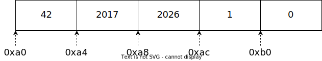

## COMP2017 2026 S1 Week 2 Tutorial A

<table><tbody>
  <tr><td><b>Tutor</b></td><td>Hao Ren</td></tr>
  <tr><td><b>Email</b></td><td><a href="hao.ren@sydney.edu.au">hao.ren@sydney.edu.au</a></td></tr>
</tbody></table>

- [COMP2017 2026 S1 Week 2 Tutorial A](#comp2017-2026-s1-week-2-tutorial-a)
  - [A.1 Compiling C Code to Executables](#a1-compiling-c-code-to-executables)
    - [A.1.1 What is the "\\n"?](#a11-what-is-the-n)
    - [A.1.2 Compiling Flags](#a12-compiling-flags)
  - [A.2 C Documentations](#a2-c-documentations)
  - [A.3 C Types](#a3-c-types)
  - [A.4 Solution: Sum \& Average of `int` Array](#a4-solution-sum--average-of-int-array)
  - [A.5 Simple Pointers](#a5-simple-pointers)
    - [A.5.1 Example in C: Treasure Hunter](#a51-example-in-c-treasure-hunter)
    - [A.5.2 Arrays and Pointers](#a52-arrays-and-pointers)
  - [A.6 What is a String in C?](#a6-what-is-a-string-in-c)

---

### A.1 Compiling C Code to Executables

```C
#include <stdio.h>

int main() {
    printf("Hello World!\n");
    return 0;
}
```

For this simple hello world codes file, we compile it by running
`gcc -o hello hello.c` in shell.

#### A.1.1 What is the "\n"?

\n likes a mark to tell your computer that you need to print a new line here.

A carriage return (`\r`) makes the cursor jump to the first column (begin of the line) while the newline (`\n`) jumps to the next line and eventually to the beginning of that line. So to be sure to be at the first position within the next line one uses both.

`\r`: `CR` (Carriage Return) → Used as a new line character in Mac OS before X;
`\n`: `LF` (Line Feed) → Used as a new line character in Unix/Mac OS X;
`\r\n`: `CR + LF` → Used as a new line character in Windows.

#### A.1.2 Compiling Flags

> [!NOTE]
> We will explain more details in [Week 3 Tutorial B](../Week%203/Week_3_Tutorial_B.md). Please refer to it for mor information.

GCC flags are just command-line switches that change how the compiler behaves. A useful mental model is: `-std=...` chooses the language rules, `-W...` controls warnings, `-g` adds debugger information, `-O...` changes optimization, and `-f...` enables extra compiler/runtime features. GCC normally preprocesses, compiles, assembles, and links in one command.

- `-Wall`: turn on a big bundle of common "this looks suspicious" warnings. Despite the name, it is **not** literally all warnings.
- `-Wextra`: add more warnings that `-Wall` does not enable.
- `-Wpedantic`: warn when code uses extensions or other constructs outside the selected ISO standard; it works together with `-std=...`.
- `-Werror`: treat warnings as errors, so the build fails on a warning. You can also do `-Werror=something` for one warning class only.
- `-Wvla`: warn when you use a variable-length array, such as `int a[n];`.
- `-Wshadow`: warn when a local name hides another variable or parameter.
- `-Wconversion`: warn about implicit conversions that may change a value, such as narrowing or signed/unsigned changes.
- `-Wformat=2`: stronger format-string checking for functions like `printf` and `scanf`.
- Most warning options also have a matching `-Wno-...` form to turn them off.

The other very common flags are:

- `-std=c11` or `-std=c23`: pick the C standard explicitly. GCC also has GNU dialects such as `gnu23`.
- `-g`: include debug info for debuggers such as GDB.
- `-Og`: optimize in a debug-friendly way; GCC recommends it for the normal edit-compile-debug cycle.
- `-O2`: a common release-build optimization level; GCC says it enables nearly all supported optimizations that do not involve a space/speed tradeoff.
- `-fsanitize=address`: runtime checking for memory bugs such as out-of-bounds access and use-after-free. GCC also recommends `-g` with it for more meaningful output.
- `-fsanitize=undefined`: runtime checking for many kinds of undefined behavior.
- `--coverage`: build with coverage instrumentation for `gcov`.

A very good student starter command for C is:

```bash
gcc -std=c11 -Wall -Wextra -Wpedantic -Wvla -g -Og main.c -o main
```

That gives you an explicit standard, the main warning bundles, a VLA warning, debug symbols, and debug-friendly optimization.

A stricter version, once students are comfortable, is:

```bash
gcc -std=c11 -Wall -Wextra -Wpedantic -Wshadow -Wconversion -Wformat=2 -Wvla -g -Og main.c -o main
```

And a good bug-hunting build is:

```bash
gcc -std=c11 -Wall -Wextra -Wpedantic -g -Og -fsanitize=address,undefined main.c -o main
```

---

### A.2 C Documentations

`man` opens the documentation (manual page) for a command/library/file format.

Examples:

```sh
man ls
man scanf
man 5 passwd
```

Man pages are organized into sections:

- `man 1` user commands (like `ls`)
- `man 2` system calls (like `read`)
- `man 3` C library functions (like `printf`, `scanf`)
- `man 5` file formats (like `passwd`)
- Search inside `man`: press `/` then type, `n` for next match, `q` to quit.
- Discover commands: `man -k keyword` (same as `apropos`)

---

### A.3 C Types

In C, a type tells the compiler what a value represents. It affects four big things: how much memory is used, how the bits are interpreted, which operations make sense, and how functions such as `printf` should read that value.

The basic built-in types are the ones you see first. `char` stores a character or a small integer value. Integer types include `short`, `int`, `long`, and `long long`, and each can be `signed` or `unsigned`. Floating-point types are `float`, `double`, and `long double`. There is also `_Bool` for true/false values, and `void`, which means “no value” or “unknown type” in some contexts.

```c
char grade = 'A';
int age = 20;
unsigned int count = 100;
double pi = 3.14159;
_Bool passed = 1;
```

C also has derived types, built from other types. A pointer stores an address, an array stores a sequence of values of the same type, and a function has a return type and parameter types. C also lets you define your own grouped types with `struct`, memory-sharing types with `union`, and named integer constants with `enum`.

```c
int x = 42;
int *p = &x;          // pointer to int
int nums[3] = {1,2,3}; // array of int

struct Point {
    int x;
    int y;
};
```

A few important beginner notes. `char` is technically an integer type. Arrays and pointers are related, but they are not the same type. The exact size of types such as `int` or `long` is implementation-defined, so do not assume they are always the same on every machine. Use `sizeof(type)` when you need the actual size.

Types also matter a lot with `printf`. The format specifier must match the type: `%d` for `int`, `%u` for `unsigned int`, `%c` for `char`, `%f` for `double` in `printf`, and `%p` for pointers.

So the main idea is simple: **in C, a type is the compiler’s way of knowing what kind of data you mean and how it should be handled.**

---

### A.4 Solution: Sum & Average of `int` Array

1. `int / int = int`
2. Compile each time you changed your codes!

```C
// Tutor: Hao Ren (hao.ren@sydney.edu.au)
// sum-and-average.c
// 2 March 2026
// Copy from Ed Lesson 1

#include <stdio.h>

int sum(int array[], unsigned int length) {
    int sum = 0;
    for (int i = 0; i < length; i++) {
        sum += array[i];
    }
    return sum;
}

float average(int total, int number) {
    return (float) total / (float) number;
}


int main() {
    unsigned int length = 0;
    scanf("%u", &length);
    int array[length];
    int temp = -1;
    for(int i = 0; i < length; i++) {
      scanf("%d", &temp);
      array[i] = temp;
    }

    printf("SUM: %d\n", sum(array, length));
    printf("AVERAGE: %f\n", average(sum(array, length), length));

    return 0;
}

```

---

### A.5 Simple Pointers

In C, a pointer is a variable that stores the address of another variable. Think of a normal variable as a box holding a value, and a pointer as a label showing where that box is in memory.

```c
int x = 42;
int *p = &x;
```

Here, `x` stores the value `42`.
`&x` means “the address of `x`”.
`p` stores that address.
`*p` means “the value at the address stored in `p`”.

So in this example:

```c
printf("x = %d\n", x);      // 42
printf("*p = %d\n", *p);    // 42
```

You can also use a pointer to change the original variable:

```c
*p = 100;
printf("x = %d\n", x);      // 100
```

That works because `p` points to `x`.

Pointers are useful for working with arrays, functions, and dynamic memory. The main idea is simple: a pointer does not store the value itself, it stores where the value is.

#### A.5.1 Example in C: Treasure Hunter

> [!IMPORTANT]
> Refer to [`island_a.c`](./Codes/island_a.c), [`island_b.c`](./Codes/island_b.c) and [`island_c.c`](./Codes/island_c.c) for solutions.

#### A.5.2 Arrays and Pointers

Following is the illustration of `int` array elements and their addresses.



> [!NOTE]
> We will discuss more about it in Tutorial B.

> [!IMPORTANT]
> Refer to [`array_addresses.c`](./Codes/array_addresses.c).

**Output:**

```
Array elements:
array[0] = 42, stored at address 0x16b4f2ca0
array[1] = 2017, stored at address 0x16b4f2ca4
array[2] = 2026, stored at address 0x16b4f2ca8
array[3] = 1, stored at address 0x16b4f2cac
array[4] = 0, stored at address 0x16b4f2cb0

Pointer p:
p = 0x16b4f2ca0, so p points to array[0]
*p = 42, the value stored at the address in p
&p = 0x16b4f2c90, the address of the pointer variable itself

Array addresses:
array     = 0x16b4f2ca0, which becomes &array[0] in this expression
&array[0] = 0x16b4f2ca0, the address of the first element
&array    = 0x16b4f2ca0, the address of the whole array
```

---

### A.6 What is a String in C?

**String is an array of characters.**

In C, an array stores multiple values of the **same type** in order. You can think of it as a row of boxes, where each box holds one value. The boxes are numbered with indexes, starting at `0`.

```c
int numbers[5] = {10, 20, 30, 40, 50};

printf("%d\n", numbers[0]);  // 10
printf("%d\n", numbers[2]);  // 30
```

Here, `numbers[0]` is the first element, `numbers[1]` is the second, and so on. One important thing is that an array has a fixed size, so `int numbers[5]` always has space for 5 integers.

Arrays are also used with characters to make strings:

```c
char word[] = "cat";
```

This looks like 3 letters, but C actually stores it as:

```c
{'c', 'a', 't', '\0'}
```

The `'\0'` is called the null character. It has value `0`, and it marks the end of a C string. Functions like `printf("%s", word)` use `'\0'` to know where the string stops. **`'\0'` is only special for character arrays used as strings. Normal arrays like `int numbers[5]` do not use `'\0'`.**

We will learn more about string in Week 3 tutorials.
