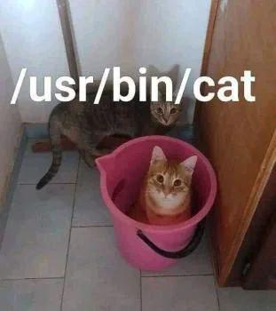
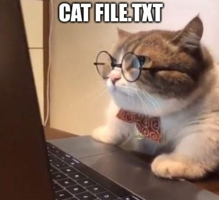

## COMP2017 2026 S1 Week 2 Tutorial B

<table><tbody>
  <tr><td><b>Tutor</b></td><td>Hao Ren</td></tr>
  <tr><td><b>Email</b></td><td><a href="hao.ren@sydney.edu.au">hao.ren@sydney.edu.au</a></td></tr>
</tbody></table>

- [COMP2017 2026 S1 Week 2 Tutorial B](#comp2017-2026-s1-week-2-tutorial-b)
  - [B.1 Introduction to Linux System](#b1-introduction-to-linux-system)
  - [B.2. Command-line: Terminal \& Shell](#b2-command-line-terminal--shell)
    - [B.2.1 Shell Shortcuts and Signals](#b21-shell-shortcuts-and-signals)
  - [B.3 PATH](#b3-path)
    - [B.3.1 When you type a command, what actually happens?](#b31-when-you-type-a-command-what-actually-happens)
    - [B.3.2 Where commands live, and PATH?](#b32-where-commands-live-and-path)
    - [B.3.3 Paths: absolute vs relative](#b33-paths-absolute-vs-relative)
  - [B.4 Common Commands](#b4-common-commands)
  - [B.5 Special Symbols \& Pipeline](#b5-special-symbols--pipeline)
    - [B.5.1 Command Chaining](#b51-command-chaining)
    - [B.5.2 More Useful "special" Operators](#b52-more-useful-special-operators)
  - [B.6 Extra Task: 5-minute Mini Lab](#b6-extra-task-5-minute-mini-lab)
  - [B.7 "Arrays vs Pointers" \& `sizeof`](#b7-arrays-vs-pointers--sizeof)
  - [B.8 Pointer Arithmetic](#b8-pointer-arithmetic)
    - [B.8.1 Array Notations vs Pointer Notations](#b81-array-notations-vs-pointer-notations)
  - [B.9 Referencing](#b9-referencing)
  - [B.10 Basic I/O](#b10-basic-io)
    - [B.10.1 Inputting from Keyboard](#b101-inputting-from-keyboard)
    - [B.10.2 Simple Output and Format Specifiers](#b102-simple-output-and-format-specifiers)

---

### B.1 Introduction to Linux System

Linux is a *Unix-like* operating system, built with the idea that you can solve big problems by combining many small programs. It grew out of the same traditions as early UNIX (where the C language became popular), so it's very friendly to C system programming and to the command-line style of working.

At the center is the **kernel**, which is the "boss" part of the OS. The kernel controls the CPU, memory, and devices, and it decides which program runs at what time. Your C program normally doesn't talk to hardware directly; instead it asks the kernel to do things through system calls, like reading a file, creating a new process, or sending data over the network.

A useful beginner mental model is: Linux is mostly about **processes** (running programs) and **files** (stored data). Many things that aren't "regular files" still behave like files, because they can be read and written as streams of bytes. That's why tools can be connected with pipes and redirection: one program's output becomes another program's input, making it easy to build powerful workflows from simple parts.

*In short, **[everything is a file](https://en.wikipedia.org/wiki/Everything_is_a_file)** in Linux!*

---

### B.2. Command-line: Terminal & Shell

A terminal is the "window" (or app) that lets you type and see text. Historically it was a physical device; today it's usually a terminal emulator like GNOME Terminal, iTerm2, Windows Terminal, etc. The terminal's job is mostly input/output: it shows characters on the screen and sends your keystrokes to a program.

That program is the shell. The shell (like `bash`, `zsh`, `fish`) is a command interpreter: it reads what you type, parses it, expands things like `*` and `~`, sets up redirection and pipes (`>`, `|`, `<`), and then runs programs for you. Some commands are built into the shell (like `cd`) because they need to change the shell's own state; most others are separate executables found via your `PATH` (like `/bin/ls`).

The command line is simply the line of text you type at the shell prompt, and "command-line interface (CLI)" is the style of interacting with programs by typing commands and reading text output. Under the hood, a lot of it is just streams: the shell connects the standard input/output of programs to the terminal, or to files, or to other programs via pipes—so you can combine tools without changing their code.

**Which shell am I using? Try `echo $0`!**

#### B.2.1 Shell Shortcuts and Signals

- `Ctrl+C` sends a `SIGINT` (Interrupt Signal) to the running program, which typically causes it to terminate immediately but allows it to perform a graceful cleanup first.
- `Ctrl+D` signals an End-Of-File (EOF) condition on the input stream and does not send a signal itself. The program then decides how to handle the end of its input.
- `Ctrl+A` move the cursor to the start of the current command line.
- `Ctrl+E` move the cursor to the end of the current command line.
- `Ctrl+U` cut (delete) everything from the cursor back to the start of the line.
- `Ctrl+W` cut (delete) the word immediately before the cursor.

Some resources might helpful; however, please keep in mind those shortcuts might be different by your system!
- <https://gist.github.com/tuxfight3r/60051ac67c5f0445efee>
- <https://justingarrison.com/blog/2020-05-28-shell-shortcuts/>
- <https://copperlight.github.io/shell/zsh-keyboard-shortcuts/>

When interrupt a program, you are actually sending a signal to process.

According to Wikipedia, *[Signal (IPC)](https://en.wikipedia.org/wiki/Signal_(IPC)) are standardized messages sent to a running program to trigger specific behavior, such as quitting or error handling. They are a limited form of inter-process communication (IPC), typically used in Unix, Unix-like, and other POSIX-compliant operating systems.*

For example:
- `SIGINT` (signal 2) is an "interactive interrupt" usually generated when you press Ctrl+C in a terminal; it's meant to politely stop the foreground program, and the program is allowed to catch it and clean up or even ignore it.
- `SIGTERM` (signal 15) is the standard "please terminate" request sent by tools like `kill` and service managers; it's catchable and is the recommended first choice for stopping a process cleanly (close files, save state, remove temp files, release application-level locks, etc.).
- `SIGKILL` (signal 9) is the "kill immediately" signal; it cannot be caught, blocked, or ignored, so the kernel forcibly stops the process right away—use it as a last resort because the program gets no chance to clean up (the OS will reclaim memory and close file descriptors, but the app can't run shutdown code).

---

### B.3 PATH

#### B.3.1 When you type a command, what actually happens?

You're usually talking to a shell (commonly `bash`, `zsh`, or `dash`). The shell:

1. Reads your line of text
2. Expands things like `~`, `$VARS`, and wildcards like `*`
3. Handles operators like `>`, `|`, `<` (redirection/pipes)
4. Finds the command you named (using PATH or builtins)
5. Runs it, passing arguments

A big concept: some "commands" are not separate programs. They're shell builtins (implemented inside the shell), because they must change the shell's own state (like the current directory).

#### B.3.2 Where commands live, and PATH?



Most commands you run are executable files stored in standard directories, commonly:

- `/bin`, `/usr/bin` (system commands)
- `/usr/sbin`, `/sbin` (admin/system management tools)
- `/usr/local/bin` (locally installed tools)

When you type `ls`, the shell usually searches for an executable named `ls` by scanning the directories listed in the environment variable `PATH`, left to right.

**Try these:**

```sh
echo $PATH
which ls
where ls
whereis ls
type ls
type cd
```

- If you specify a slash, the shell does NOT search PATH. So `./myprog` runs the file named `myprog` in the current directory.
- For security, "current directory" is often not in PATH by default. That's why you use `./`.

- `where`: In `csh`/`tcsh`, `where cmd` shows all places the shell would find `cmd` (and can mention aliases/builtins), *but it usually doesn't exist in `bash` by default.*
- `whereis`: `whereis cmd` searches a few standard system directories to show locations of a command's binary, source, and/or man page (often returning multiple paths).
- `which`: `which cmd` prints the executable path that would be run for `cmd` by searching your `PATH` (typically the first match, and it may not reflect aliases/functions).
- `command -v cmd` (POSIX) or `type cmd` (shell builtin) tells you how the shell will resolve `cmd` (builtin/function/alias vs external path), which is usually the most reliable way to check. **`type` is great because it tells you whether something is a builtin, alias, function, or external program.**

#### B.3.3 Paths: absolute vs relative

- Absolute path: starts with `/` (from the filesystem root), e.g. `/home/hao_ren/file.txt`
- Relative path: does not start with `/`, relative to your current working directory, e.g. `notes/file.txt`
- Extra essential command (worth adding): `pwd` (print working directory)

  ```sh
  pwd
  ```

- Home directory is usually stored in `$HOME`. `~` expands to it. **We will see more "special" symbols in the following section.**

---

### B.4 Common Commands

- **`cd` (change directory)**

  `cd` changes the shell's current working directory (CWD). It's typically a shell builtin. **And it affects where relative paths point.**

  ```sh
  cd /etc
  cd ..        # go to parent directory
  cd           # go to home directory
  cd ~         # also home
  cd -         # go back to previous directory
  ```

- **`mkdir` (make directory)**

  Creates a directory. Directories are part of the filesystem tree; `mkdir` adds a new node.

  ```sh
  mkdir project
  mkdir -p project/src/include   # create parent dirs as needed
  ```

- **`ls` (list directory)**

  Lists files in a directory (default is current directory).

  Examples:

  ```sh
  ls
  ls /etc
  ls -l
  ```

  `ls -a` shows "hidden" entries (names beginning with `.`):

  ```sh
  ls -a
  ```

  Useful options to mention (optional but practical):

  - `-l` long listing (permissions, owner, size, time)
  - `-h` human-readable sizes (often paired with `-l`: `ls -lh`)
  - `-F` appends indicators (`/` for directories, `*` for executables)

  **Why hidden files exist?**

  For Convention: dotfiles like `.bashrc`, `.gitignore` are config/metadata and hidden from casual listing.

- **`cat` (concatenate / print file) & `less`**
  Prints file contents to stdout. Also concatenates multiple files.

  

  ```sh
  cat file.txt
  cat a.txt b.txt > combined.txt
  ```

  `cat` is great for small files. For long output, teach `less`:

  ```sh
  less file.txt
  ```

- **`chmod` (change permissions)**
  Changes file "mode bits" (permissions). Permissions are split into user/group/others (u/g/o) and read/write/execute (r/w/x), where "Executable" means the OS is allowed to run it as a program (or as a script interpreter target).

  See permissions with `ls -l`: For example, `-rwxr-x---` (file; user can rwx; group can r-x; others none)

  - `1` for read (`r`);
  - `2` for write (`w`);
  - `4` for execute (`x`);
  - Therefore, `7` means `rwx` and `3` means `rw-`, etc.

  ```sh
  chmod u+x script.sh      # add execute for user
  chmod 755 script.sh      # rwx r-x r-x (numeric form)
  chmod 644 notes.txt      # rw- r-- r-- (typical text file)
  ```

- **`rmdir` (remove empty directory)**
  Removes directories only if they are empty.

  ```sh
  rmdir emptydir
  ```

  If it's not empty, it fails (this is a feature; safer for beginners). To remove non-empty directories you use `rm -r`, which is powerful but **dangerous**.

- **`echo` (print text)**
  Writes its arguments to stdout.

  ```sh
  echo Hello
  echo "Hello there"
  echo $HOME
  ```

  Common uses:

  - Show variable values (`echo $PATH`)
  - Create simple files (`echo hi > file.txt`)
  - Quick debugging in shell scripts

- **`mv` (move / rename)**
  Moves a file or renames it (same operation in Unix).

  ```sh
  mv oldname.txt newname.txt
  mv file.txt dir/
  ```

  - Rename within same filesystem is usually fast (metadata change).
  - Moving across filesystems can involve copying then deleting.

- **`cp` (copy)**
  Copies files (and directories with `-r`).

  ```sh
  cp a.txt b.txt
  cp -r dir1 dir2
  cp -a dir1 dir1_backup   # archive mode (preserve attributes), common on GNU cp
  ```

- **`rm` (remove files)**
  Deletes files (no recycle bin by default). Use carefully.

  ```sh
  rm file.txt
  rm -i file.txt     # ask before removing (good for teaching)
  rm -r dir/         # remove directory recursively (dangerous)
  rm -rf dir/        # force recursive (very dangerous; avoid teaching as a habit)
  ```

  "Remove" unlinks directory entries; data may be gone immediately (or later overwritten). **Treat `rm` as permanent.**

- **`touch` (create file / update timestamps)**
  If the file doesn't exist, creates an empty file. If it exists, updates its access/modify timestamps.

  ```sh
  touch newfile.txt
  touch existing.txt
  ```

- **`head` / `tail`**
  First/last lines of a file.

  ```sh
  head -n 20 file.txt
  tail -n 20 file.txt
  tail -f logfile.txt
  ```

- **`grep` (Search text)**

  ```sh
  grep "error" file.txt
  ls -l | grep ".c"
  ```

---

### B.5 Special Symbols & Pipeline

**These are not "commands"; most are interpreted by the shell (or are path syntax).**

- **`~` (tilde)**
  - Expands to your home directory.
  - `~/Downloads` means "Downloads inside my home".

- **`/` (slash)**
  - Root of the filesystem (leading `/`)
  - Also the path separator: `a/b/c`

- **`.` (dot)**
  - Current directory.
  - Example: `./runme` means "run `runme` from here".

- **`..` (dot dot)**
  - Parent directory.
  - Example: `cd ..` moves up one level.

- **`>` (redirect stdout, overwrite)**
  - Sends command output into a file, replacing its contents.

  ```sh
  echo hello > out.txt
  ```

- **`>>` (redirect stdout, append)**
  - Appends output to the end of a file.

  ```sh
  echo hello >> out.txt
  ```

- **`<` (redirect stdin from a file)**
  - Feeds a file as input to a command.

  ```sh
  cat < out.txt
  ```

- **`|` (pipe)**
  - Connects stdout of the left command to stdin of the right command.
  - This is one of the most important shell concepts.

  ```sh
  ls -l | less
  cat file.txt | grep error
  ```

#### B.5.1 Command Chaining

- `cmd1 && cmd2` runs cmd2 only if cmd1 succeeded
- `cmd1 || cmd2` runs cmd2 only if cmd1 failed
- `;` runs regardless

```sh
make && ./program
```

Very important concept behind `>`, `>>`, `<`, `|`: **Redirection and pipes are set up by the shell before the program runs. The program just reads stdin and writes stdout like normal.**

#### B.5.2 More Useful "special" Operators

- **`*`, `?`, `[abc]` (globbing/wildcards)**
  - The shell expands these into matching filenames before running the command.
  - Example: `ls *.c` lists all `.c` files.

- **Quoting (prevents expansions)**
  - Single quotes `'...'`: no expansions at all.
  - Double quotes `"..."`: `$VARS` expand, but spaces stay grouped.

  ```sh
  echo *.c        # expands to filenames
  echo "*.c"      # prints literal *.c
  echo '$HOME'    # prints literal $HOME
  echo "$HOME"    # prints your home path
  ```

---

### B.6 Extra Task: 5-minute Mini Lab

Practice the core workflow: make folders, create files (`touch`, `echo >` / `>>`), inspect (`cat/less`), copy/move, permissions (`chmod`), and a pipeline (`| grep |`).

**1. Create a workspace and move into it**

  ```sh
  cd
  mkdir -p ~/mini_lab/{docs,bin}
  cd ~/mini_lab
  ls
  ```

**2. Create files with touch, then put content in them with redirection**

  ```sh
  touch docs/notes.txt docs/app.log
  echo "Hello Linux" > docs/notes.txt
  echo "INFO: start" > docs/app.log
  echo "ERROR: something broke" >> docs/app.log
  echo "INFO: end" >> docs/app.log
  ```

**3. Inspect files quickly**

  ```sh
  cat docs/notes.txt
  less docs/app.log    # press q to quit
  ```

**4. Copy and move (rename)**

  ```sh
  cp docs/notes.txt docs/notes.bak
  mv docs/notes.txt docs/notes_old.txt
  ls docs
  ```

**5. Permissions: make a small script and run it**

  ```sh
  touch bin/hello.sh
  echo '#!/bin/sh' > bin/hello.sh
  echo 'echo "Hi from script"' >> bin/hello.sh
  chmod u+x bin/hello.sh
  ./bin/hello.sh
  ```

**6. Pipeline: filter log lines with grep**

  ```sh
  cat docs/app.log | grep "ERROR"
  ```

---

### B.7 "Arrays vs Pointers" & `sizeof`

> Refer to [`dec.c`](./Codes/dec.c) for source codes and more demonstrations.

- `sizeof(ptr) = 8`: `ptr` is a pointer that `sizeof(ptr) = 8`.
- `sizeof(array) = 6`: `array[] = "hello"` creates an array containing the characters plus the terminating '\0'.
- `sizeof(array2) = 5`: `array2` has exactly 5 elements that `sizeof(array2) = 5`.
- `sizeof(array3) = 6`: `array3` has 6 elements (explicit terminator) that `sizeof(array3) = 6`.
- *Note: array2 is not a C string (no '\0'). Passing it to %s / strlen would be undefined behavior.*
- `sizeof(*ptr) = 1`: `*ptr` has type `char` (dereferencing gives you a single character), so: `sizeof(*ptr) = sizeof(char) = 1` where `printf("%c\n", *ptr);` returns a single `h`.
- `sizeof(&array) = 8`
- `sizeof(&array2) = 8`
- `sizeof(&array3) = 8`: `&array` is the address of the whole array object. `array` has type `const char[6]`, `&array` has type `const char (*)[6]` (pointer to an array of 6 chars).
- *Note: Again: only the ones with a '\0' (like `array`, `array3`, `array5`, `array6`, `array7`, `array8`) are safe to treat as C strings (though `array7` is an empty string).*

`sizeof` answers "how many bytes does this *type/object* occupy?" It does **not** answer "how many characters are in this string?" and it does **not** "look through" a pointer to find the thing it points at.

**Any other problem in the function `unarray`?**

---

### B.8 Pointer Arithmetic

Pointer arithmetic in C is arithmetic on addresses, scaled by the size of the pointed-to type. If `T *p` points to elements of type `T`, then:
- `p + k` means "address of the `k`-th next `T`" (moves by `k * sizeof(T)` bytes).
- `p - k` means "`k` elements backwards".
- `p[i]` is defined as `*(p + i)` where array indexing is just pointer arithmetic + dereference.
- `&p[i]` is `p + i` (when `p` is an array, `p` in an expression decays to `&p[0]`).
- `*` and `&` cancel when they're applied in a compatible way e.g. `&*p == p`.

Be careful! Think "elements, not bytes" for `p + k`; think "bytes" only after casting to `char *` (because `sizeof(char) == 1`).

#### B.8.1 Array Notations vs Pointer Notations

Correct are marked **bold**.

**Question 1: `*p`**

`*p` means "the value at the address in `p`", i.e. the 0th element.

- a. `(p + 0)` is just a pointer value (same as `p`), not the pointed-to value.
- b. `*(p + 1)` is the next element (`p[1]`).
- **c. `p[0] == *p == *(p + 0)`**.
- d. `p` is the pointer itself.

**Question 2: `*(p + 10)`**

- a. `p + 10` is the pointer to the 10th element, not the value.
- b. `p[11] == *(p + 11)`.
- c. `p[9] == *(p + 9)`.
- **d. `*(p + 10) == p[10]`.**

**Question 3: `&r[20]`**

`r[20]` means the 21st element. By definition, `r[20] == *(r + 20)`.
So `r[20]` is a VALUE of type `T`.

`&r[20]` means the address of that 21st element.
So `&r[20]` is a POINTER of type `T *`.

- **a. `r + 20 = &r[20]`**
- b. `*(r + 20)` is the value at index 20, i.e. `r[20]`, not its address.
- c. `r[20]` is the value, not the address.
- d. `a + 20` (Please don't tell me if you even choose this 😁).

**Question 4: `&(g[0])`**

`g[0]` is the first element, so `&(g[0])` is the address of the first element, i.e. `g` decayed to pointer: `g == &g[0]`.

- a. `*(g[0])` tries to dereference `g[0]` (nonsense unless `g[0]` itself is a pointer, but still incorrect).
- b. `*g` is `g[0]` (the value), not the address.
- c. `**g`
- **d. `g`**

**Question 5: `&*p`**

`&` and `*` cancel (when `p` is a valid pointer to an object): `&(*p) == p`.

- a. `*p` is the value, not the pointer.
- **b. `p`**
- c. `&p` is the address of the pointer variable itself (type would be `T **` if `p` is `T *`).
- d. `p[0]` is same as `*p` (value), not `p`.

**Question 6: `&((r[5])[5])`**

This one implies `r[5]` is itself an array (or pointer), so `r` is likely a 2D array-ish thing, e.g. `T r[...][...]` or `T (*r)[...]`.

Read it as: take row 5, then element 5 within that row, then take its address.

- `r[5]` is `*(r + 5)` (the 5th row)
- `(r[5])[5]` is `*(*(r + 5) + 5)` (the element)
- taking address gives `*(r + 5) + 5` (address within the row)

- a. `r[5]` points to the start of row 5, i.e. `&r[5][0]`.
- b. `(r + 5) + 5 == r+10` changes the row index, not the column.
- c. `*(r + 5)` is the row itself (which then decays), not offset by 5.
- **d. `r[5] + 5`**
- e. `r + 25` is jumping rows by 25, not columns within a row.

---

### B.9 Referencing

What doesn't seem right is that `swap(x, y)` is passing the values of `x` and `y` into `swap`. In C, function arguments are passed by value, so `swap` only receives copies. Swapping those copies won't change variables in `main` function.

> Refer to [`swap.c`](./Codes/swap.c) for source codes.

What we are going to do is
1. Fix the `swap` function to take two pointers (addresses of `x` and `y`) as arguments.
2. Passing **addresses* into function `swap` in our `main` function.

---

### B.10 Basic I/O

#### B.10.1 Inputting from Keyboard

`scanf` is formatted, token-based input: it parses numbers/words according to a format string, usually skips leading whitespace (except `%c`), stops at whitespace for `%s`, and is easy to misuse unless you check its return value and use width limits to avoid buffer overflow.

`gets` is an obsolete line-input function that reads until newline with no buffer size, so it can overflow your array; it's been removed from the C standard and **should never be used**.

`fgets` is safe line-based input: it reads up to `n-1` characters into a buffer you provide, can include spaces, keeps the newline if it fits, and always null-terminates (when it reads anything), making it the standard "read a whole line safely" choice.

`getchar` is low-level character input: it reads one character from `stdin` and returns an `int` so it can also return `EOF`; it's great for character-by-character processing, loops until EOF, or consuming leftover characters/newlines.

> Let's back to the Tutorial A's exercise and refer to codes [`repeat.c`](./Codes/repeat.c).

#### B.10.2 Simple Output and Format Specifiers

<https://www.geeksforgeeks.org/c/format-specifiers-in-c/>

- `%c`: For character type.
- `%d`: For signed integer type.
- `%e`: For scientific notation of floats.
- `%f`: For float type.
- `%g`: For float type with the current precision.
- `%i`: For signed integer type.
- `%ld` or %`li`: For long type.
- `%lf`: For double type.
- `%Lf`: For long double type.
- `%lu`: For unsigned integer or unsigned long type.
- `%lli` or `%lld`: For long long type.
- `%llu`: For unsigned long long type.
- `%o`: For octal representation.
- `%p`: For pointer type.
- `%s`: For string type.
- `%u`: For unsigned integer.
- `%x` or `%X`: For hexadecimal representation.
- `%zu`: For `size_t` type.
- `%n`: Prints nothing.
- `%%`: **Prints "%" character.**
