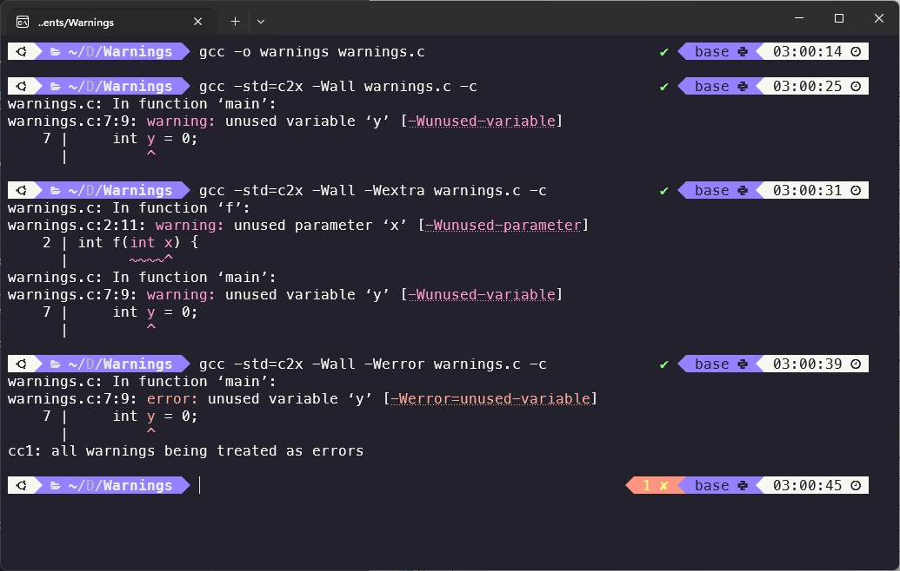
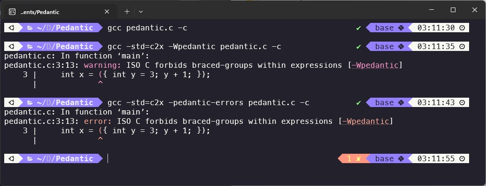
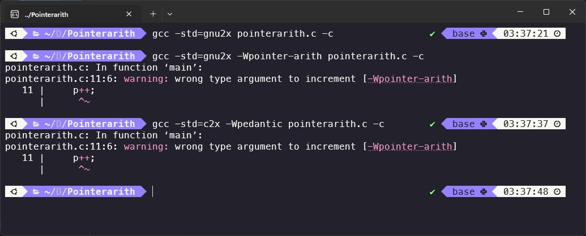
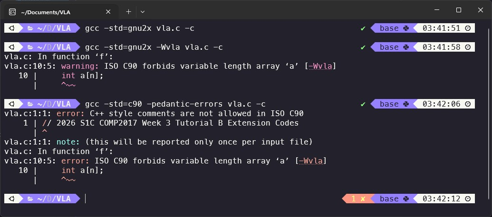
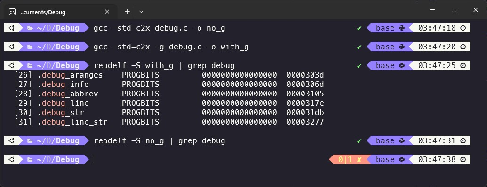
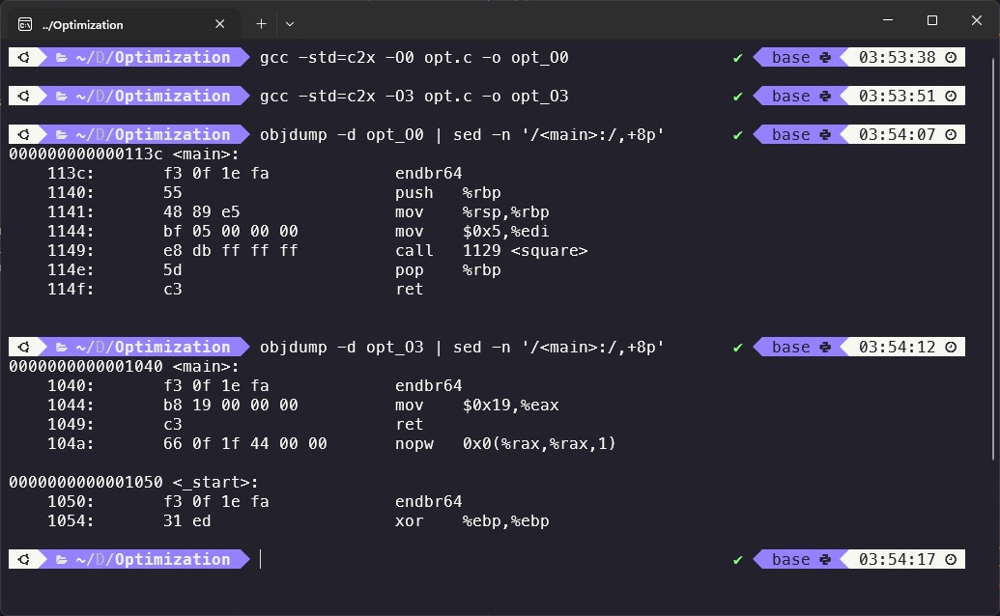
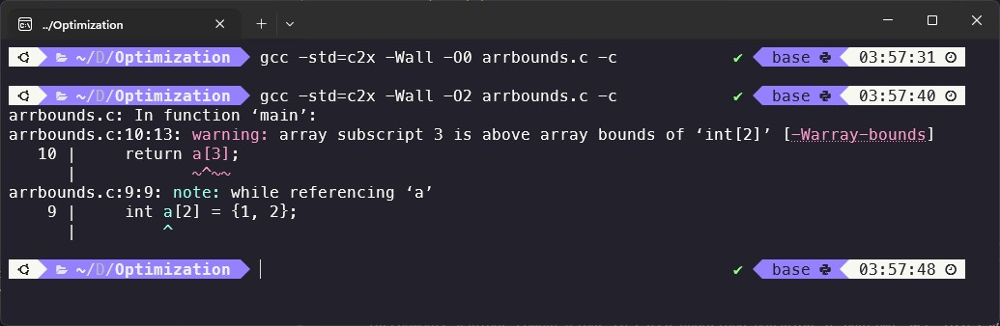
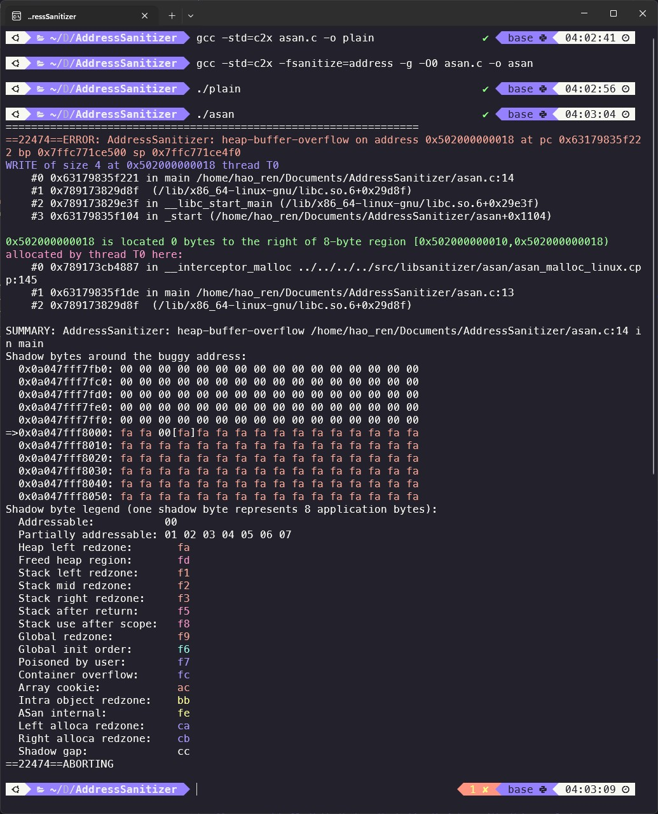
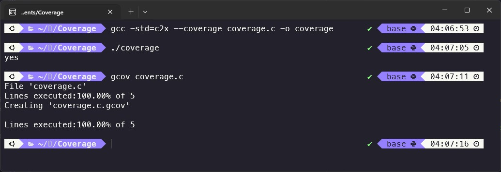

## COMP2017 2026 S1 Week 3 Tutorial B

<table><tbody>
  <tr><td><b>Tutor</b></td><td>Hao Ren</td></tr>
  <tr><td><b>Email</b></td><td><a href="hao.ren@sydney.edu.au">hao.ren@sydney.edu.au</a></td></tr>
</tbody></table>

- [COMP2017 2026 S1 Week 3 Tutorial B](#comp2017-2026-s1-week-3-tutorial-b)
  - [B.1 Preprocessor](#b1-preprocessor)
    - [B.1.1 `#define`](#b11-define)
      - [A Common Mistake When Using Macro](#a-common-mistake-when-using-macro)
      - [Macro: An Advanced Extension Exercise](#macro-an-advanced-extension-exercise)
    - [B.1.2 `#include`](#b12-include)
    - [B.1.3 Function Declarations](#b13-function-declarations)
  - [B.2 Useful Compiler Flags](#b2-useful-compiler-flags)
    - [B.2.1 The Warning Flags](#b21-the-warning-flags)
    - [B.2.2 Language-Standard and Conformance Flags](#b22-language-standard-and-conformance-flags)
    - [B.2.3 `-Wpointer-arith` and `-Wvla`](#b23--wpointer-arith-and--wvla)
    - [B.2.4 Debugging](#b24-debugging)
    - [B.2.5 Optimization](#b25-optimization)
    - [B.2.6 Runtime Instrumentation](#b26-runtime-instrumentation)
    - [B.2.7 Coverage](#b27-coverage)
    - [B.2.8 Some Useful Complier Flags Combo](#b28-some-useful-complier-flags-combo)
  - [B.3 C String Standard Library and `string.h`](#b3-c-string-standard-library-and-stringh)
    - [B.3.1 `strcpy()` vs `strncpy()`](#b31-strcpy-vs-strncpy)
    - [B.3.2 `strlen()` vs `strnlen()`](#b32-strlen-vs-strnlen)
    - [B.3.3 `strcmp()` vs `strncmp()`](#b33-strcmp-vs-strncmp)
    - [B.3.4 Other Useful String Functions](#b34-other-useful-string-functions)
  - [B.4 Exercise: Shout (Convert Lower Case to Upper Case)](#b4-exercise-shout-convert-lower-case-to-upper-case)
  - [B.5 Exercise: Password Generator](#b5-exercise-password-generator)

---

### B.1 Preprocessor

In C, lines starting with # are usually handled by the preprocessor before the program is compiled.

#### B.1.1 `#define`

`#define` is used to create constants or macros. **It does simple text replacement.**

```C
#define PI 3.14159
#define SIZE 100
```

After preprocessing, every `PI` in the code is replaced with `3.14159`, and every `SIZE` is replaced with `100`.

> [!CAUTION]
> A very important point is that #define is only **text substitution**. It is not a real variable, and it does not have a type.

> [!WARNING]
> No semicolon after `#define`!

##### A Common Mistake When Using Macro

Let us check the following macro in "Lesson Week 3 - TRACE".

```C
#include <stdio.h>

#define SQUARE(x) x * x

int main() {
    int result = SQUARE(3 + 2); // Expected: 25
    printf("Result: %d\n", result); // Result: 11
    return 0;
}
```

What is the output of this program, and why does this unexpected result occur? Please manually expand the macro to explain your reasoning. Additionally, **how can we fix the issue?**

```C
#define SQUARE(x) ((x) * (x))
```

This should be written carefully with brackets, because macros can cause bugs if operator precedence changes the meaning.

##### Macro: An Advanced Extension Exercise

You see this macro in a codebase:

```C
#define MAX(a,b) ((a) > (b) ? (a) : (b))
```

A student writes `MAX(i++, j++)`. What can go wrong? Give at least two distinct failure modes. Show two safer alternatives (one macro-based, one non-macro-based), and explain tradeoffs.

**Answer:**

`MAX(i++, j++)` is unsafe because the macro evaluates its arguments more than once depending on the branch taken. In `((a) > (b) ? (a) : (b))`, whichever side "wins" gets evaluated again in the result expression. That means one of `i++` or `j++` will be incremented twice, the other once, and exactly which one depends on the comparison outcome (which itself has side effects).

#### B.1.2 `#include`

`#include` is used to include header files. Header files usually contain function declarations and useful definitions.

```C
#include <stdio.h>
#include <string.h>
```

`#include <...>` is normally used for system headers, such as the standard library.
`#include "..."` is normally used for your own local header files.

#### B.1.3 Function Declarations

A function declaration, also called a function prototype, tells the compiler that a function exists before it sees the full function body.

```C
#include <stdio.h>

int add(int a, int b);   // function declaration

int main(void)
{
    int result = add(3, 4);
    printf("%d\n", result);
    return 0;
}

int add(int a, int b) {
    return a + b;
}
```

---

### B.2 Useful Compiler Flags

#### B.2.1 The Warning Flags

- `-Wall` enables a large set of common warnings that catch suspicious code, but it does not literally mean "all warnings."
- `-Wextra` adds more warnings that are not in `-Wall`, and many other warnings still need to be enabled individually.
- `-Werror` turns warnings into errors, so code that would compile with warnings now fails to compile.
- `-Wpedantic` (or the older spelling `-pedantic`) asks GCC to diagnose code that uses non-ISO extensions, based on the language standard selected with `-std`.
- `-pedantic-errors` is stronger: it turns required diagnostics into errors, and it is not the same as `-Werror=pedantic`.
- `-Wpointer-arith` warns about things like arithmetic on `void *`, and GCC documents that this warning is also enabled by `-Wpedantic`.
- `-Wvla` warns when variable-length arrays are used.
- `-Wshadow`: warn when a local name hides another variable or parameter.
- `-Wconversion`: warn about implicit conversions that may change a value, such as narrowing or signed/unsigned changes.
- `-Wformat=2`: stronger format-string checking for functions like `printf` and `scanf`.
- Most warning options also have a matching `-Wno-...` form to turn them off.

A very useful first example is the difference between `-Wall`, `-Wextra`, and `-Werror`.

```C
/* warnings.c */
int f(int x) {
    return 42;
}

int main(void) {
    int y = 0;
    return f(1);
}
```

**Try these commands by yourself:**

```bash
gcc -std=c23 -Wall warnings.c -c
gcc -std=c23 -Wall -Wextra warnings.c -c
gcc -std=c23 -Wall -Werror warnings.c -c
```



That is the simplest way to show the difference between "warn me" and "refuse to build until I fix it." GCC's manual specifically notes that `-Wall` is a curated set of common warnings, while `-Wextra` adds more warnings not enabled by `-Wall`, and `-Werror` promotes warnings to errors.

#### B.2.2 Language-Standard and Conformance Flags

The next group is language-standard and conformance flags. `-std=c23` means “compile as ISO C23.” `-std=gnu23` means “compile as C23 plus GNU extensions.” Since current GCC defaults to `gnu23`, some GNU-only features compile silently unless you ask for stricter checking. That is why `-Wpedantic` makes most sense when paired with an explicit `-std=...`.

Use this example to show the difference:

```C
/* pedantic.c */
int main(void) {
    int x = ({ int y = 3; y + 1; });
    return x;
}
```

Try:

```bash
gcc pedantic.c -c
gcc -std=c23 -Wpedantic pedantic.c -c
gcc -std=c23 -pedantic-errors pedantic.c -c
```



In short,
- with the default GNU dialect, GCC accepts the GNU statement-expression extension;
- with `-std=c23 -Wpedantic`, GCC warns that this is not ISO C;
- with `-pedantic-errors`, that warning becomes a build error.

That example makes the idea of "GNU dialect versus strict ISO dialect" very concrete. GCC's documentation says `-Wpedantic` diagnoses forbidden extensions according to the selected standard, and that `-pedantic-errors` is stronger than simply writing `-Werror=pedantic`.

#### B.2.3 `-Wpointer-arith` and `-Wvla`

```C
/* pointerarith.c */
int main(void) {
    void *p = 0;
    p++;
    return 0;
}
```

```bash
gcc -std=gnu23 pointerarith.c -c
gcc -std=gnu23 -Wpointer-arith pointerarith.c -c
gcc -std=c23 -Wpedantic pointerarith.c -c
```



This shows that plain GNU mode may accept the code quietly, but `-Wpointer-arith` warns, and `-Wpedantic` also warns because GCC treats this as a non-ISO construct.

```C
/* vla.c */
int f(int n) {
    int a[n];
    return a[0];
}
```

```bash
gcc -std=gnu23 vla.c -c
gcc -std=gnu23 -Wvla vla.c -c
gcc -std=c90 -pedantic-errors vla.c -c
```



This shows that `-Wvla` is useful when you want to avoid VLAs even if the compiler accepts them, and `-pedantic-errors` can force stricter standard compliance. GCC documents `-Wvla` explicitly, and also notes that `-pedantic-errors` upgrades `-Wvla` diagnostics to errors in modes where the standard requires a diagnostic.

#### B.2.4 Debugging

`-g` tells GCC to emit debug information so a debugger such as GDB can map machine code back to source lines and variables.

```C
/* debug.c */
int add(int a, int b) {
    int sum = a + b;
    return sum;
}

int main(void) {
    return add(2, 3);
}
```

Compile it both ways:

```bash
gcc -std=c23 debug.c -o no_g
gcc -std=c23 -g debug.c -o with_g
readelf -S with_g | grep debug
readelf -S no_g | grep debug
```

You will see that the build with `-g` contains debug sections, while the plain build does not. That makes `-g` feel tangible rather than magical.



#### B.2.5 Optimization

`-O3` is an aggressive optimization level: GCC says it enables everything in `-O2` plus additional loop and interprocedural optimizations. GCC also warns that optimization can make debugging harder because variables can disappear, statements can move, and control flow may no longer match the source one-to-one. GCC's own docs recommend `-Og` together with `-g` for the normal edit-compile-debug cycle when you are not using some other optimization level.

```C
/* opt.c */
static int square(int x) {
    return x * x;
}

int main(void) {
    return square(5);
}
```

Try:

```bash
gcc -std=c23 -O0 opt.c -o opt_O0
gcc -std=c23 -O3 opt.c -o opt_O3
objdump -d opt_O0 | sed -n '/<main>:/,+8p'
objdump -d opt_O3 | sed -n '/<main>:/,+8p'
```

At `-O0`, you will usually see a normal function call to `square`. At `-O3`, the compiler may inline the function and constant-fold the result so that `main` just returns `25`. That is a very clean way to show what "optimization" really means in practice. GCC's documentation says `-O3` adds further optimizations beyond `-O2`, and that optimization can change debugging behavior substantially.



One subtle but important teaching point is that some warnings depend on optimization. GCC explicitly says that some warnings are more effective, or only appear, when optimization is enabled; for example, `-Wall` includes `-Warray-bounds=1`, but only with `-O2`.

This example shows that interaction well:

```C
/* arrbounds.c */
int main(void) {
    int a[2] = {1, 2};
    return a[3];
}
```

Try:

```bash
gcc -std=c23 -Wall -O0 arrbounds.c -c
gcc -std=c23 -Wall -O2 arrbounds.c -c
```

You could often find it surprising that `-Wall` alone may say nothing at `-O0`, but the same code can produce an array-bounds warning at `-O2`. This is a good moment to explain that some warnings need data-flow analysis that happens during optimization.



#### B.2.6 Runtime Instrumentation

The last big group we are going to learn is runtime instrumentation. `-fsanitize=address` enables AddressSanitizer, which GCC describes as a fast memory error detector for out-of-bounds accesses and use-after-free bugs. `-fsanitize=undefined` enables UndefinedBehaviorSanitizer, which instruments various computations to catch undefined behavior at runtime. GCC also says that for more useful sanitizer output you should compile with `-g`, and for better stack traces it is often helpful to use `-O0`, `-O1`, or `-Og`. **GCC further notes that sanitizers can increase false positives around some warnings and recommends against combining `-Werror` with sanitizers.**

```C
/* asan.c */
#include <stdlib.h>

int main(void) {
    int *p = malloc(2 * sizeof(int));
    p[2] = 42;   /* out of bounds */
    free(p);
    return 0;
}
```

Try:

```bash
gcc -std=c23 asan.c -o plain
gcc -std=c23 -fsanitize=address -g -O0 asan.c -o asan
./plain
./asan
```



The plain program may appear to run, or it may crash unpredictably. The ASan build is instrumented and should report a heap-buffer-overflow with a source line. That is one of the examples for "undefined behavior is not reliable, and sanitizers help you catch it."

#### B.2.7 Coverage

For `--coverage`, GCC says this flag instruments code for coverage analysis and is equivalent to `-fprofile-arcs -ftest-coverage` when compiling and `-lgcov` when linking. GCC’s gcov documentation also notes that if your goal is exact line-by-line coverage, you generally should not optimize at the same time, because optimization can combine or eliminate lines.

A simple coverage example is:

```C
/* coverage.c */
#include <stdio.h>

int main(void) {
    int x = 1;
    if (x) {
        puts("yes");
    }
    return 0;
}
```

Try:

```bash
gcc -std=c23 --coverage coverage.c -o coverage
./coverage
gcov coverage.c
```



You can then look for the generated `.gcno` and `.gcda` files and see that the compiler has added extra bookkeeping for coverage.

#### B.2.8 Some Useful Complier Flags Combo

For tutorial work, a very sensible default build is:

```bash
gcc -std=c23 -Wall -Wextra -Wpedantic -Wpointer-arith -Wvla -g -Og file.c -o file
```

That gives students a modern standard, strong warnings, useful debugging information, and a debug-friendly optimization level. For bug-hunting, add sanitizers:

```bash
gcc -std=c23 -Wall -Wextra -Wpedantic -Wpointer-arith -Wvla -g -Og \
    -fsanitize=address,undefined file.c -o file
```

For coverage:

```bash
gcc -std=c23 -Wall -Wextra -Wpedantic --coverage file.c -o file
```

For performance experiments:

```bash
gcc -std=c23 -O3 file.c -o file
```

The main idea to leave students with is: `-std` chooses the language, `-W...` flags tell GCC how strict to be, `-g` helps you debug, `-O...` changes how aggressively GCC rewrites the program, and instrumentation flags such as sanitizers and coverage add runtime checking or measurement.

---

### B.3 C String Standard Library and `string.h`

A C string is not a separate built-in type. It is a sequence of `char` values that ends with a null terminator, `'\0'`. The `string(3)` manual says the string functions operate on null-terminated strings, and the `string.h` header also includes byte-oriented memory functions such as `memchr()`, `memcmp()`, `memcpy()`, `memmove()`, and `memset()`. `str*` functions usually expect proper C strings, while `mem*` functions work on raw bytes and use an explicit length.

#### B.3.1 `strcpy()` vs `strncpy()`

`strcpy()` copies the source string into the destination, including the terminating `'\0'`. The destination buffer must already be large enough, and overlapping source and destination objects give undefined behavior.

```C
char src[] = "hello";
char dst[10];

strcpy(dst, src);
printf("%s\n", dst);
```

`strncpy()` is different. It copies at most `n` bytes. If the source string is shorter than `n`, it pads the rest of the destination with null bytes. If the source does not contain a `'\0'` in the first `n` bytes, the result is **not** null-terminated. Overlap is also undefined here.

```C
char name[5];
strncpy(name, "Daniel", sizeof name);
```

In practice, `strncpy()` is often misunderstood. The Linux `string_copying(7)` page explains that `strncpy()` writes a null-padded character sequence in a fixed-size buffer, not necessarily a normal C string, and notes that it has a long history of misuse. That makes it more suitable for fixed-width fields than for ordinary "safe string copying."

A good rule is this: use `strcpy()` only when you know the destination is large enough, and to be very cautious with `strncpy()`, **because "length-limited" does not automatically mean "safe string."**

#### B.3.2 `strlen()` vs `strnlen()`

`strlen()` returns the number of bytes in a string before the terminating `'\0'`. It does not count the terminator itself.

```C
char word[] = "tofu";
printf("%zu\n", strlen(word));
```

`strnlen()` does a bounded version of that check. It returns the smaller of the actual string length and `maxlen`, and it never looks past the first `maxlen` bytes. The `strlen(3)` page explicitly notes that when a buffer may not contain a terminating null byte, `strnlen()` should be used instead.

```C
char buf[5] = {'a', 'b', 'c', 'd', 'e'};
printf("%zu\n", strnlen(buf, sizeof buf));
```

This example is useful because `buf` is a character array, but it is not a C string. `strnlen()` can still examine it safely within the given bound, while `strlen()` would keep searching for a terminator beyond the intended buffer.

#### B.3.3 `strcmp()` vs `strncmp()`

`strcmp()` compares two strings and returns `0` when they are equal, a negative value when the first string is less than the second, and a positive value when the first is greater. `strncmp()` is the same idea, except it compares only the first `n` bytes at most.

```C
printf("%d\n", strcmp("abc", "abc"));
printf("%d\n", strcmp("abc", "abd"));
printf("%d\n", strncmp("comp2017", "comp1000", 4));
```

This is where many beginners go wrong: `if (strcmp(a, b))` means "if they are different," not "if they are equal." Another important detail is that POSIX guarantees only the sign of a nonzero result, so students should test `== 0`, `< 0`, or `> 0`, not `== 1` or `== -1`.

```C
if (strncmp("tutorial", "tut", 3) == 0) {
    printf("same first 3 characters\n");
}
```

That shows why `strncmp()` is useful, but also why it is not a full equality test unless `n` covers the whole strings.

#### B.3.4 Other Useful String Functions

`strchr()` finds the first occurrence of a character in a string, and `strrchr()` finds the last. If the character is `'\0'`, they can return a pointer to the terminator itself. `strstr()` finds the first occurrence of one string inside another.

```C
char text[] = "banana";
printf("%s\n", strchr(text, 'n'));
printf("%s\n", strstr(text, "ana"));
```

`strspn()` and `strcspn()` are very handy for input processing. `strspn()` gives the length of the initial prefix consisting only of accepted characters, while `strcspn()` gives the length of the initial prefix consisting of characters not in a reject set.

A very practical use of `strcspn()` is removing the newline left by `fgets()`:

```C
char line[100];
fgets(line, sizeof line, stdin);
line[strcspn(line, "\n")] = '\0';
```

That works because `strcspn(line, "\n")` finds the position of the first newline, or the end of the string if no newline is present.

`strtok()` breaks a string into tokens separated by delimiter characters. On the first call, you pass the string; on later calls, you pass `NULL` to continue tokenizing the same string. It modifies the original string by overwriting delimiters with `'\0'`, cannot be used on constant strings, and returns only nonempty tokens. `strtok_r()` is the reentrant version.

```C
char s[] = "red,green,blue";
char *tok = strtok(s, ",");

while (tok != NULL) {
    puts(tok);
    tok = strtok(NULL, ",");
}
```

> [!NOTE]
> Please note `string.h` is not only for strings. The same header also gives you the memory functions, which are for raw bytes rather than null-terminated strings. **We will cover some of them later this semester.**

---

### B.4 Exercise: Shout (Convert Lower Case to Upper Case)

We could use the ASCII difference between lowercase and uppercase letters. In ASCII, `'a'` to `'z'` are `97` to `122` and `'A'` to `'Z'` are `65` to `90`. Therefore, we have `'a' - 'A' == 32`.

> [!IMPORTANT]
> Refer to [`shout.c`](./Codes/shout.c) for source codes written by me.

---

### B.5 Exercise: Password Generator

> [!IMPORTANT]
> Refer to [`pass_gen.c`](./Codes/pass_gen.c) for source codes written by me.

Use `argv[1]` as the requested password length. Seed the pseudo-random generator with `srand()`, then generate characters from a **printable ASCII range**. The simplest starter version is to choose uniformly from ASCII `33` to `126` so that you see symbols, digits, and letters appearing in the output.
