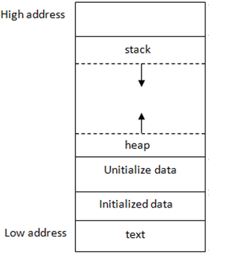
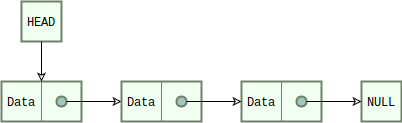
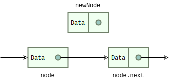
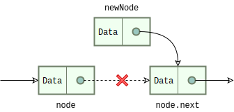
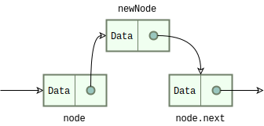
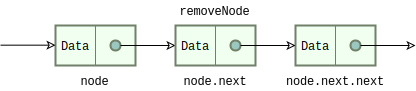
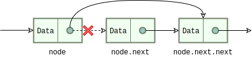
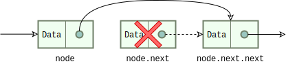
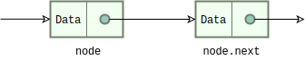

## COMP2017 2026 S1 Week 5 Tutorial B

<table><tbody>
  <tr><td><b>Tutor</b></td><td>Hao Ren</td></tr>
  <tr><td><b>Email</b></td><td><a href="hao.ren@sydney.edu.au">hao.ren@sydney.edu.au</a></td></tr>
</tbody></table>

- [COMP2017 2026 S1 Week 5 Tutorial B](#comp2017-2026-s1-week-5-tutorial-b)
  - [B.1 Stack and Heap](#b1-stack-and-heap)
    - [B.1.1 Stack](#b11-stack)
    - [B.1.2 Heap](#b12-heap)
    - [B.1.3 The Pointer is Not the Array](#b13-the-pointer-is-not-the-array)
    - [B.1.4 Stack vs Heap: Lifetime Matters](#b14-stack-vs-heap-lifetime-matters)
    - [B.1.5 When Should We Use the Heap?](#b15-when-should-we-use-the-heap)
  - [B.2 Memory Management Functions in C](#b2-memory-management-functions-in-c)
    - [B.2.1 `malloc()`: Allocate Memory](#b21-malloc-allocate-memory)
    - [B.2.2 `calloc()`: Allocate and Zero-Initialise](#b22-calloc-allocate-and-zero-initialise)
    - [B.2.3 `realloc()`: Resize Existing Memory](#b23-realloc-resize-existing-memory)
    - [B.2.4 `free()`: Release Memory](#b24-free-release-memory)
    - [B.2.5 Common Memory Mistakes](#b25-common-memory-mistakes)
  - [B.3 Singly Linked List](#b3-singly-linked-list)
    - [B.3.1: `list_init()`](#b31-list_init)
    - [B.3.2: `list_add()`](#b32-list_add)
    - [B.3.3: `list_insert()`](#b33-list_insert)
    - [B.3.4: `list_next()`](#b34-list_next)
    - [B.3.5: `list_delete()`](#b35-list_delete)
    - [B.3.6: `list_free()`](#b36-list_free)
  - [B.4 Exercise: Retrieving `k`-th Last Node](#b4-exercise-retrieving-k-th-last-node)
    - [B.4.1 The Simpler Method](#b41-the-simpler-method)
    - [B.4.2 Two Pointers Method](#b42-two-pointers-method)

---

### B.1 Stack and Heap



When a C program runs, its memory is usually organised into several regions. A common simplified layout includes:

- the **text** segment, which stores the program instructions
- the **data** segment, which stores global and static variables
- the **heap**, which stores dynamically allocated memory
- the **stack**, which stores function calls, parameters, and local variables

In this tutorial, we will mainly focus on the stack and the heap.

#### B.1.1 Stack

The stack stores **stack frames**. Each time a function is called, a new frame is created for that call. That frame typically contains the function's parameters and local variables. When the function returns, its frame is removed automatically.

```c
void f(void) {
    int x = 5;
    int arr[10];
}
```

In this example, `x` and `arr` are local variables, so they typically live on the stack.

Important properties of the stack:

- memory is created automatically when a function starts
- memory is released automatically when the function returns
- allocation is usually fast
- stack space is limited
- data on the stack does not survive after the function returns

Because function calls are added and removed in order, the stack follows a **last-in, first-out (LIFO)** pattern.

#### B.1.2 Heap

The heap stores **dynamically allocated memory**. In C, you request heap memory with functions such as `malloc`, `calloc`, and `realloc`.

```c
int *arr = malloc(10 * sizeof *arr);
```

This creates space for 10 integers on the heap.

Important properties of the heap:

- memory is created only when your program asks for it
- memory stays valid until you call `free`
- it is useful when the size is known only at runtime
- it is useful for large data or resizable data structures
- the programmer must manage it manually

Unlike the stack, heap memory is not removed automatically when a function returns.

#### B.1.3 The Pointer is Not the Array

This is one of the most important ideas in this topic.

```c
int *arr = malloc(10 * sizeof *arr);
```

Here, `arr` is a pointer variable. If it is declared inside a function, then the pointer variable itself typically lives on the stack. However, the 10 integers created by `malloc` live on the heap.

So there are two different things:

- the pointer variable
- the block of memory that the pointer points to

```text
Stack:                     Heap:
arr  ------------------>   [ int ][ int ][ int ][ int ] ...
```

The pointer and the memory block it points to do not have to live in the same place.

#### B.1.4 Stack vs Heap: Lifetime Matters

The biggest difference between stack and heap is **lifetime**.

- Stack memory usually lasts only until the current function returns.
- Heap memory lasts until it is explicitly freed.

This is why returning the address of a local variable is wrong:

```c
int *bad(void) {
    int x = 42;
    return &x;   // wrong
}
```

`x` is a stack variable, so it stops being valid after `bad` returns.

Heap memory can outlive the function that created it:

```c
int *make_array(int n) {
    int *arr = malloc(n * sizeof *arr);
    return arr;   // okay, as long as the caller later calls free(arr)
}
```

Here the local pointer `arr` disappears when the function returns, but the heap block remains allocated.

#### B.1.5 When Should We Use the Heap?

We usually allocate memory on the heap when:

1. The size is only known at runtime.

    ```c
    int n;
    scanf("%d", &n);

    int *arr = malloc(n * sizeof *arr);
    ```

2. The data is too large for the stack.

    ```c
    int *arr = malloc(1000000 * sizeof *arr);
    ```

3. The data must outlive the current function.
4. The size may need to change later.

This is especially common for dynamic arrays, text buffers, linked lists, trees, and other data structures.

---

### B.2 Memory Management Functions in C

The C standard library provides several functions for working with heap memory. The most common ones are `malloc`, `calloc`, `realloc`, and `free`.

#### B.2.1 `malloc()`: Allocate Memory

`malloc()` allocates a block of memory of a given number of bytes and returns a pointer to the beginning of that block.

```c
int *arr = malloc(10 * sizeof *arr);
```

A common C style is:

```c
int *arr = malloc(n * sizeof *arr);
```

This is usually preferred over writing `sizeof(int)` explicitly, because the expression automatically matches the type of `arr`.

After allocation, you can use the block like an array:

```c
arr[0] = 11;
arr[1] = 22;
arr[9] = 99;
```

> [!CAUTION]
> `malloc()` does **not** initialise the memory. The bytes may contain leftover values, so reading them before writing is a bug.

```c
int *arr = malloc(5 * sizeof *arr);
printf("%d\n", arr[0]);   // undefined value
```

You should initialise the memory yourself:

```c
for (int i = 0; i < 5; i++) {
    arr[i] = 0;
}
```

It is also good practice to check whether allocation succeeded:

```c
int *arr = malloc(n * sizeof *arr);
if (arr == NULL) {
    return 1;
}
```

#### B.2.2 `calloc()`: Allocate and Zero-Initialise

`calloc()` is similar to `malloc()`, but it also sets the allocated bytes to zero.

```c
int *zeros = calloc(10, sizeof *zeros);
```

The meaning of the arguments is:

```c
calloc(number_of_elements, size_of_each_element)
```

For an array of `int`, zero-initialised bytes mean each element starts as `0`.

```c
printf("%d\n", zeros[0]);   // 0
printf("%d\n", zeros[1]);   // 0
```

`calloc()` is useful when you want newly allocated memory to start in a known zero state.

#### B.2.3 `realloc()`: Resize Existing Memory

Sometimes you do not know the final size in advance. In that case, you can resize an existing heap block with `realloc`.

```c
char *buffer = malloc(100 * sizeof *buffer);
char *tmp = realloc(buffer, 200 * sizeof *buffer);
if (tmp != NULL) {
    buffer = tmp;
}
```

`realloc()` may do one of two things:
- enlarge or shrink the existing block in place
- allocate a new block, copy the old contents, free the old block, and return a new pointer

So the returned address *may be* different from the old one.

A safer pattern is to store the result in a temporary pointer first. If `realloc` fails, it returns `NULL`, and the original pointer is still valid.

A common resizing strategy is to double the capacity when the buffer becomes full:

```text
8 -> 16 -> 32 -> 64 -> 128
```

This is much more efficient than increasing the size by only one element each time.

#### B.2.4 `free()`: Release Memory

When you are finished with a heap block, you must release it with `free`.

```c
free(arr);
```

After `free`, the pointer variable still exists, but the memory it pointed to is no longer valid. From your program's point of view, that block is no longer yours and may be reused later.

This is wrong:

```c
free(arr);
arr[0] = 5;   // wrong: use after free
```

This kind of bug is called **use-after-free**.

A common habit is to set the pointer to `NULL` after freeing it:

```c
free(arr);
arr = NULL;
```

> [!CAUTION]
> This does not restore the memory, but it can help prevent accidental reuse of a dangling pointer later.

#### B.2.5 Common Memory Mistakes

Here are some common mistakes to avoid:

- **Returning the address of a local variable**

    ```c
    int *bad(void) {
        int x = 10;
        return &x;   // wrong
    }
    ```

- **Forgetting to free heap memory**, which causes a **memory leak**

    ```c
    int *arr = malloc(100 * sizeof *arr);
    /* use arr */
    /* forgot free(arr); */
    ```

- **Using memory after freeing it**

    ```c
    free(arr);
    printf("%d\n", arr[0]);   // wrong
    ```

- **Freeing the same block twice**

    ```c
    free(arr);
    free(arr);   // wrong
    ```

If you allocate memory on the heap, make sure there is a clear plan for who will free it.

---

### B.3 Singly Linked List

> [!IMPORTANT]
> Refer to [`list.c`](./Codes/list.c) for the code used in this section.

For a singly linked list, each node stores a value and a pointer to the next node. The last node has `next == NULL`. A struct could be

```c
struct node {
    int value;
    struct node *next;
};
```



#### B.3.1: `list_init()`

This function creates the first node in a new list. We need to:
1. allocate memory with `malloc()`
2. store the value
3. set `next` to `NULL`

```c
struct node* list_init(int value) {
    struct node *head = malloc(sizeof(struct node));
    if (head == NULL) {
        return NULL;
    }

    head->value = value;
    head->next = NULL;
    return head;
}
```

Example:

```c
struct node *head = list_init(5);
```

Now the list is:

```text
5 -> NULL
```

#### B.3.2: `list_add()`

> [!CAUTION]
> It could be commonly confused with `list_insert()`.

To add a new node **at the end**:

1. allocate a new node
2. fill in its value
3. set its `next` to `NULL`
4. if the list is empty, make it the head
5. otherwise walk to the last node and attach the new node

```c
void list_add(struct node** head, int value) {
    if (head == NULL) {
        return;
    }

    struct node *new_node = malloc(sizeof(struct node));
    if (new_node == NULL) {
        return;
    }

    new_node->value = value;
    new_node->next = NULL;

    if (*head == NULL) {
        *head = new_node;
        return;
    }

    struct node *curr = *head;
    while (curr->next != NULL) {
        curr = curr->next;
    }

    curr->next = new_node;
}
```

Example:

```c
struct node *head = list_init(10);
list_add(&head, 20);
list_add(&head, 30);
```

Result:

```text
10 -> 20 -> 30 -> NULL
```

#### B.3.3: `list_insert()`

> [!CAUTION]
> It could be commonly confused with `list_add()`.







#### B.3.4: `list_next()`

This one is simple. Return the next node. If `n == NULL`, return `NULL`.

```c
struct node* list_next(const struct node* n) {
    if (n == NULL) {
        return NULL;
    }

    return n->next;
}
```

Example:

```c
struct node *second = list_next(head);
```

If `head` points to the first node, then `second` points to the second node.

#### B.3.5: `list_delete()`

This function removes a specific node from the list. There are two cases:
1. the node to delete is the head
2. the node to delete is somewhere later in the list

If it is the head, we move the head forward and free the old head; If it is not the head, we must find the node before it, then skip over the deleted node.









```c
void list_delete(struct node** head, struct node* n) {
    if (head == NULL || *head == NULL || n == NULL) {
        return;
    }

    if (*head == n) {
        *head = n->next;
        free(n);
        return;
    }

    struct node *curr = *head;
    while (curr->next != NULL && curr->next != n) {
        curr = curr->next;
    }

    if (curr->next == n) {
        curr->next = n->next;
        free(n);
    }
}
```

Usage Example:

```c
list_delete(&head, n);
```

Important note for your notes: this deletes by **pointer**, not by value. So it removes the exact node `n`, not just "some node with the same value".

#### B.3.6: `list_free()`

This function frees the whole list. We repeatedly:
1. remember the next node
2. free the current node
3. move forward

At the end, set the head to `NULL`.

```c
void list_free(struct node** head) {
    if (head == NULL) {
        return;
    }

    struct node *curr = *head;
    while (curr != NULL) {
        struct node *next = curr->next;
        free(curr);
        curr = next;
    }

    *head = NULL;
}
```

Example:

```c
list_free(&head);
```

After this, `head == NULL`.

---

### B.4 Exercise: Retrieving `k`-th Last Node

For example, if the list is `[1, 2, 3, 4]` and `k = 2`, the answer is `3`.

#### B.4.1 The Simpler Method

There is a simpler method:
1. traverse the list once to count the length
2. go to position `length - k`

That is also `O(n)`, but it uses **two passes** over the list.

#### B.4.2 Two Pointers Method

> [!IMPORTANT]
> Refer to [`list_kth_last.c`](./Codes/list_kth_last.c) for the code used in this section.

To find the k-th last node in a singly linked list in `O(n)` time, use two pointers. Move the first pointer `k` nodes ahead. Then move both pointers one step at a time until the first pointer reaches `NULL`. Because the distance between the two pointers stays `k`, the second pointer will be pointing at the k-th last node.

Be careful about these edge cases:
- if `head == NULL`, return `NULL`
- if `k <= 0`, return `NULL`
- if `k` is larger than the list length, return `NULL`

The two-pointer method is better because it finds the answer in **one traversal**.
