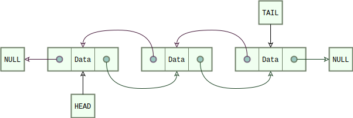
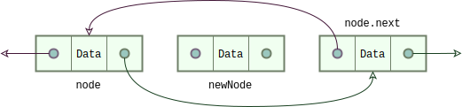
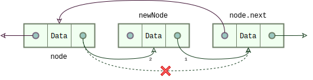
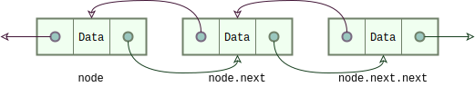
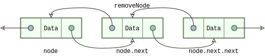
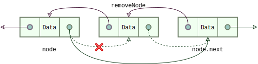
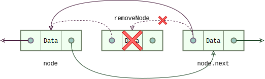
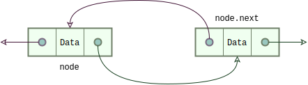

## COMP2017 2026 S1 Week 6 Tutorial A

<table><tbody>
  <tr><td><b>Tutor</b></td><td>Hao Ren</td></tr>
  <tr><td><b>Email</b></td><td><a href="hao.ren@sydney.edu.au">hao.ren@sydney.edu.au</a></td></tr>
</tbody></table>

[TOC]

---

### A.1 Doubly and Circular Linked List

---

### A.2 Exercise: Circular Linked List

> [!IMPORTANT]
> Refer to [`circular.c`](./Codes/circular.c) for the code used in this section.

---

### A.3 Exercise: Detect Cycle in Linked List

> <https://leetcode.com/problems/linked-list-cycle/description/>

---

### A.4 Exercise: Dynamic Array

> [!IMPORTANT]
> Refer to [`dyn_array.c`](./Codes/dyn_array.c) for the code used in this section.

---

### A.5 Void Pointers

---

### A.6 Generic Lists

> [!IMPORTANT]
> Refer to [`generic_list.c`](./Codes/generic_list.c) for the code used in this section.
