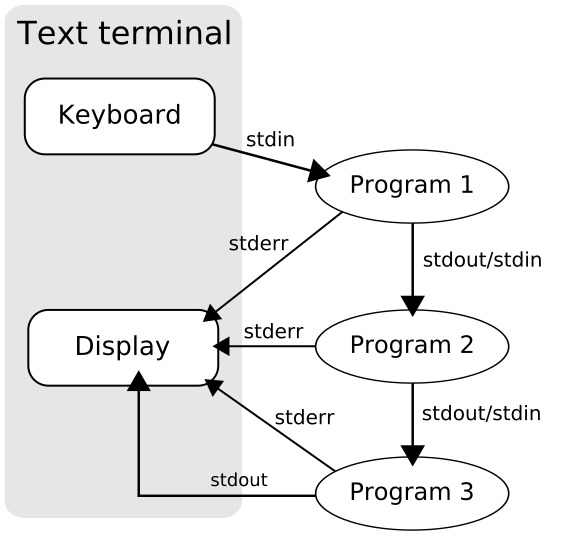
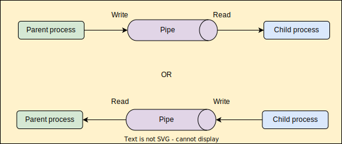
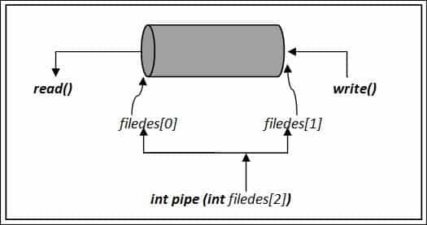
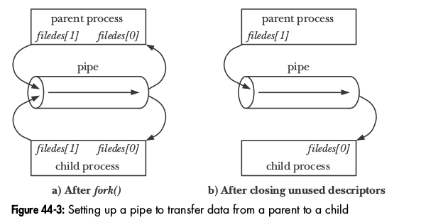
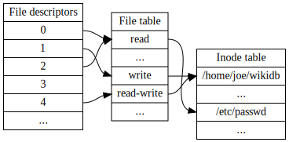

## COMP2017 2026 S1 Week 9 Tutorial B

<table><tbody>
  <tr><td><b>Tutor</b></td><td>Hao Ren</td></tr>
  <tr><td><b>Email</b></td><td><a href="hao.ren@sydney.edu.au">hao.ren@sydney.edu.au</a></td></tr>
</tbody></table>

- [COMP2017 2026 S1 Week 9 Tutorial B](#comp2017-2026-s1-week-9-tutorial-b)
  - [B.1 Inter-Process Communication (IPC)](#b1-inter-process-communication-ipc)
    - [B.1.1 Threads vs Processes](#b11-threads-vs-processes)
    - [B.1.2 Shared Memory](#b12-shared-memory)
      - [Shared Memory Example Idea](#shared-memory-example-idea)
    - [B.1.3 Message Passing](#b13-message-passing)
    - [B.1.4 Pipes](#b14-pipes)
      - [Anonymous Pipes](#anonymous-pipes)
      - [Named Pipes](#named-pipes)
    - [B.1.5 Sockets](#b15-sockets)
      - [Socket Example](#socket-example)
  - [B.2 Message Passing: Pipes](#b2-message-passing-pipes)
    - [B.2.1 `pipe()`](#b21-pipe)
    - [B.2.2 `pipe()` with `fork()` and `exec*()`](#b22-pipe-with-fork-and-exec)
    - [B.2.3 Unidirectional Communication](#b23-unidirectional-communication)
    - [B.2.4 Closing Unused Pipe Ends](#b24-closing-unused-pipe-ends)
    - [B.2.5 Blocking Behaviors](#b25-blocking-behaviors)
      - [Reading When the Write End is Closed](#reading-when-the-write-end-is-closed)
      - [Writing When the Read End is Closed](#writing-when-the-read-end-is-closed)
    - [B.2.6 Does One `write()` Always Match One `read()`? No.](#b26-does-one-write-always-match-one-read-no)
  - [B.3 File Descriptor Table](#b3-file-descriptor-table)
    - [B.3.1 Core Concept](#b31-core-concept)
    - [B.3.2 `close()`](#b32-close)
    - [B.3.3 `dup()`](#b33-dup)
    - [B.3.4 Redirecting Standard Output to a Pipe](#b34-redirecting-standard-output-to-a-pipe)
    - [B.3.5 `dup2()`](#b35-dup2)
    - [B.3.6 File Descriptor Table after `fork()`](#b36-file-descriptor-table-after-fork)
    - [B.3.7 File Descriptors across `exec()`](#b37-file-descriptors-across-exec)
    - [B.3.8 `fdopen()`: Converting a File Descriptor into a `FILE *`](#b38-fdopen-converting-a-file-descriptor-into-a-file-)
    - [B.3.9 File Descriptors vs `FILE *`](#b39-file-descriptors-vs-file-)
  - [B.4 Exercise: It's COMP2017 Time](#b4-exercise-its-comp2017-time)
    - [B.4.1 Step 1: Create Two Pipes Before `fork()`](#b41-step-1-create-two-pipes-before-fork)
    - [B.4.2 Step 2: Close Unused Pipe Ends](#b42-step-2-close-unused-pipe-ends)
    - [B.4.3 Step 3: Use the Pipes to Enforce the Order](#b43-step-3-use-the-pipes-to-enforce-the-order)
  - [B.5 Exercise: Scissors, Paper, Rock](#b5-exercise-scissors-paper-rock)
    - [B.5.1 Step 1: Use Two Pipes per Player](#b51-step-1-use-two-pipes-per-player)
    - [B.5.2 Step 2: Define a Simple Protocol](#b52-step-2-define-a-simple-protocol)
    - [B.5.3 Step 3: Synchronise the 5 Seconds Timing](#b53-step-3-synchronise-the-5-seconds-timing)
    - [B.5.4 Step 4: Compare Moves](#b54-step-4-compare-moves)
    - [B.5.5 Hints from Tutor](#b55-hints-from-tutor)
      - [Why Only One Process Should Sleep?](#why-only-one-process-should-sleep)
      - [Why `fflush()` Matters](#why-fflush-matters)
  - [B.6 Exercise: Bash Simulator II](#b6-exercise-bash-simulator-ii)
    - [B.6.1 Step 1: Run One Command](#b61-step-1-run-one-command)
    - [B.6.2 Step 2: Use `dup2()` inside the Child](#b62-step-2-use-dup2-inside-the-child)
    - [B.6.3 Step 3: Run Multiple Commands with Pipes](#b63-step-3-run-multiple-commands-with-pipes)
    - [B.6.4 Some Small Mistakes in Our Scaffold](#b64-some-small-mistakes-in-our-scaffold)
      - [Removing the Newline after Parsing](#removing-the-newline-after-parsing)
      - [Allocating the Children Array with the Wrong Size](#allocating-the-children-array-with-the-wrong-size)
      - [Using the Wrong Variable Names](#using-the-wrong-variable-names)

---

### B.1 Inter-Process Communication (IPC)

When a program has multiple **threads** or **processes**, separate running parts of a program need a safe way to share data or send information to each other. Communication is useful, but it is also a common source of bugs. If two parts of a program depend too much on each other, the program can become harder to reason about and less parallel. A good systems-programming design usually tries to:

1. split work so each part can run mostly independently,
2. communicate only when necessary,
3. make the communication method clear and controlled.

#### B.1.1 Threads vs Processes

Before talking about IPC, it helps to separate **threads** and **processes**.

A **thread** is an execution path inside a process. Threads in the same process share the same address space, so they can usually communicate through ordinary shared variables.

A **process** is a separate running instance of a program. Each process has its own memory image, so one process cannot normally access another process's variables directly.

IPC is mainly about communication between processes. Threads often communicate through shared memory already, but they still need synchronization such as mutexes or condition variables.

There are two broad IPC styles:

1. **shared memory**
2. **message passing**

Pipes and sockets are examples of message-passing mechanisms.

#### B.1.2 Shared Memory

With **shared memory**, two or more processes access the same region of memory. Instead of sending data back and forth, both processes read and write to a shared memory area. The intuition is that shared memory is like placing a shared notebook on a table; each process can read from it or write to it.

Shared memory gives processes access to the same bytes, but it does not automatically make access safe.

For example:

```text
Process A is halfway through writing a message.
Process B reads the memory at the same time.
```

Process B may see incomplete or inconsistent data.

So shared memory usually needs synchronization tools such as:

```text
semaphores
mutexes placed in shared memory
condition variables placed in shared memory
file locks
atomic operations
```

The exact tool depends on the system and the program.

##### Shared Memory Example Idea

Imagine a producer-consumer setup:

```text
Producer process:
    writes items into a shared buffer

Consumer process:
    reads items from the shared buffer
```

The shared buffer alone is not enough. The processes also need to track:

```text
where the next item should be written
where the next item should be read
whether the buffer is full
whether the buffer is empty
```

This is why shared memory often becomes more complex than it first looks.

Shared memory is fast, but it is easy to get wrong.

It is best used when:

```text
large amounts of data need to be shared
copying data would be expensive
the synchronization design is clear
```

It is not automatically better than message passing.

#### B.1.3 Message Passing

With **message passing**, processes communicate by sending data through an operating-system-managed communication channel. The intuition is that instead of sharing a notebook, one process sends a note to another process. The sender does not usually give the receiver direct access to its memory. It sends bytes through a mechanism such as a pipe, FIFO, or socket.

Message passing is often easier to reason about than shared memory because data moves in a more controlled way.

For example:

```text
Process A sends: "hello"
Process B receives: "hello"
```

The receiver gets data only when something has been sent. This avoids some shared-memory bugs because processes are not directly writing to the same memory location.

However, message passing can still have timing problems. For example:

```text
Process B tries to read before Process A writes.
```

Depending on the file descriptor mode and system call used, the read may block, fail, or return no data.

Moreover, message passing is usually safer and simpler than shared memory, but it may involve more copying and kernel involvement.

A rough comparison:

```text
Shared memory:
    faster for large shared data
    harder to synchronize correctly

Message passing:
    easier to structure
    often safer conceptually
    may involve more copying
```

#### B.1.4 Pipes

> [!IMPORTANT]
> **We will cover more details about pipes in section 3 of this tutorial.**

A **pipe** is an IPC mechanism that lets one process send bytes to another process. The usual intuition is "a pipe is a one-way stream of bytes". One end is used for writing, and the other end is used for reading. Pipes are commonly used when a parent and child process need to communicate after `fork()`.

##### Anonymous Pipes

An **unnamed pipe** is created with `pipe()`.

It does not have a name in the filesystem. It is usually used between related processes, such as a parent and child after `fork()`. The important idea is that both parent and child inherit the file descriptors after `fork()`. And don't forget that closing unused pipe ends is very important. If unused ends stay open, the reader may never see end-of-file because the operating system still thinks there is a writer.

##### Named Pipes

A **named pipe** is also called a **FIFO**. Unlike an unnamed pipe, it has a name in the filesystem. For example, a named pipe might appear as:

```text
/tmp/my_pipe
```

A named pipe can be opened by unrelated processes, as long as they know the path.

#### B.1.5 Sockets

A **socket** is a more general communication endpoint. The intuition is that a socket is like a connection point that processes can use to send and receive data.

Sockets can be used for communication:

```text
between processes on the same machine
between processes on different machines over a network
```

This makes sockets more flexible than pipes.

There are different kinds of sockets.

- A **Unix domain socket** is used for communication between processes on the same machine.
- An **Internet socket** is used for communication over a network using protocols such as TCP or UDP.

For example:

```text
Unix domain socket:
    process-to-process communication on the same computer

TCP socket:
    reliable byte stream between machines

UDP socket:
    message-oriented datagrams, but not reliable in the same way as TCP
```

Sockets are often used for client-server programs.

##### Socket Example

A web browser and a web server communicate using sockets.

```text
browser process  <--->  network socket  <--->  server process
```

A local server program might also use sockets even when client and server are on the same machine.

For example:

```text
client process sends request
server process receives request
server process sends response
client process receives response
```

---

### B.2 Message Passing: Pipes

> **Introduction from [Wikipedia](https://en.wikipedia.org/wiki/Pipeline_(Unix))**
> In Unix-like computer operating systems, a pipeline is a mechanism for inter-process communication using message passing. A pipeline is a set of processes chained together by their standard streams, so that the output text of each process (stdout) is passed directly as input (stdin) to the next one. The second process is started as the first process is still executing, and they are executed concurrently.
>
> The pipes in the pipeline are anonymous pipes (as opposed to named pipes), where data written by one process is buffered by the operating system until it is read by the next process, and this uni-directional channel disappears when the processes are completed. The standard shell syntax for anonymous pipes is to list multiple commands, separated by vertical bars ("pipes" in common Unix verbiage).



And now, we are going to talk about the usage of pipes in our program.

A **pipe** is one of the simplest forms of message passing. It connects a writer to a reader:

```text
process writing data  --->  pipe  --->  process reading data
```

A pipe is especially useful with `fork()` because the child process inherits the parent's file descriptors. This means the parent and child can both access the same pipe after `fork()`. We say a pipe is a unidirectional byte stream managed by the kernel.



It is common to describe pipes as passing "messages", but ordinary Unix pipes do not preserve message boundaries in the way a message queue would.

A pipe is a **byte stream**.

For example, one process might write twice:

```c
write(fd, "hello", 5);
write(fd, "world", 5);
```

The reader might receive:

```text
helloworld
```

or it might read only part of the data, depending on the size of the buffer used in `read()`.

So a pipe does not automatically tell the receiver:

```text
this was message 1
this was message 2
```

If we need messages, we define a simple protocol ourselves.

For example:

```text
hello\n
world\n
```

Now the receiver can treat each line as one message.

#### B.2.1 `pipe()`



The `pipe()` function from `unistd.h` creates a pipe and gives us two file descriptors.

```c
int pipefd[2];

// `pipe()` returns `0` on success and returns `-1` on error.
if (pipe(pipefd) < 0) {
    perror("unable to create pipe");
}
```

After this call:

```text
pipefd[0] = read end
pipefd[1] = write end
```

The data flow looks like this:

```text
write(pipefd[1], ...)  --->  kernel pipe buffer  --->  read(pipefd[0], ...)
```

Anything written to `pipefd[1]` can be read from `pipefd[0]`.

#### B.2.2 `pipe()` with `fork()` and `exec*()`

In this progress, `fork()` creates a child process by duplicating the current process. That includes the current process's file descriptor table. So if a parent process creates a pipe before calling `fork()`, both the parent and the child will have file descriptors for the same pipe.

> [!NOTE]
> Please refer to section 3 to learn more about file descriptors.

The file descriptor numbers are copied, but they still refer to the same underlying kernel object. So after `fork()`, both processes have descriptors referring to the same pipe in the kernel. This behavior is useful because it lets the parent set up communication before creating the child.

File descriptors are also usually preserved across `exec*()`. This is slightly different from `fork()`.

- `fork()` creates a new process.
- `exec()` replaces the current process image with a new program.

However, by default, open file descriptors remain open across `exec()`.

> [!IMPORTANT]
> Refer to [`pipe.c`](./Codes/pipe.c) for demonstrations.

#### B.2.3 Unidirectional Communication

A single pipe is one-way.

```text
pipefd[1] writes
pipefd[0] reads
```

So this works naturally:

```text
parent writes  --->  child reads
```

or:

```text
child writes  --->  parent reads
```

But one pipe is not enough for both directions at the same time. For two-way communication, we usually need two pipes or a more suitable mechanism such as `socketpair()`.

For our two-pipe idea, if the parent and child both need to send messages to each other, we can use two pipes:

```text
pipe 1: parent writes, child reads
pipe 2: child writes, parent reads
```

Conceptually:

```text
parent_to_child[1] ---> parent_to_child[0]
child_to_parent[1] ---> child_to_parent[0]
```

This gives each direction its own channel.

#### B.2.4 Closing Unused Pipe Ends

Closing unused ends is not just cleanup. It affects program behavior.

Suppose the parent is reading from a pipe. The parent will usually see end-of-file only when all write ends of the pipe are closed. If some process still has the write end open, the kernel thinks more data might still arrive.

So this can block forever:

```c
read(pipefd[0], buffer, sizeof(buffer));
```

even if no process actually plans to write more data.

That is why this pattern is important:

```c
if (pid == 0) {
    close(pipefd[0]);  // child does not read
    // write...
    close(pipefd[1]);
} else {
    close(pipefd[1]);  // parent does not write
    // read...
    close(pipefd[0]);
}
```



#### B.2.5 Blocking Behaviors

A call to `read()` on a pipe may block. This means the function might not return immediately.

For example:

```c
read(pipefd[0], buffer, sizeof(buffer));
```

If there is no data available, but at least one write end is still open, `read()` will usually wait. The process is paused at that line until data becomes available or the pipe is closed.

In addition, a call to `write()` on a pipe may also block. The kernel stores pipe data in a limited buffer. If the buffer is full, a writer may need to wait until some process reads data from the pipe.

Conceptually:

```text
writer writes data
kernel pipe buffer fills up
writer blocks until reader consumes some data
```

This is one reason pipes are useful but also require careful design. If the reader stops reading, the writer may get stuck.

##### Reading When the Write End is Closed

If all write ends of a pipe are closed, then `read()` eventually returns `0`. A return value of `0` means end-of-file.

```c
ssize_t nread = read(pipefd[0], buffer, sizeof(buffer));

if (nread == 0) {
    printf("end of file\n");
}
```

For pipes, end-of-file means "there is no more data, and no process still has the pipe open for writing".

##### Writing When the Read End is Closed

If a process writes to a pipe after all read ends are closed, the write may fail. Usually, the process receives `SIGPIPE`, and `write()` may fail with `EPIPE`.

The practical idea is that do not keep writing if no process is reading. This is another reason to handle errors from `write()` in real programs.

#### B.2.6 Does One `write()` Always Match One `read()`? No.

**No.**

Pipes are byte streams. One `read()` may receive:

```text
part of one write
one full write
multiple writes together
```

The program should not assume that one write equals one read. For small writes, POSIX provides some atomicity guarantees up to `PIPE_BUF`, but that does not mean the receiver's `read()` will always return exactly one logical message. It only means writes up to that size from multiple writers will not be interleaved with each other.

For simple programs, the safe habit is always check how many bytes read() or write() actually processed.

Important practical rules:

- check `pipe()` and `fork()` return values
- close unused pipe ends
- remember that pipes are byte streams
- do not assume one read equals one write
- handle blocking behavior
- wait for child processes when needed

---

### B.3 File Descriptor Table

We have learned about the file descriptor in week 5 when we talked about the file input/output. Today we are going to dig deeper and focus on its usages in process aspect.

The core idea is: *A process does not directly store open files, pipes, sockets, or terminals inside normal C variables. Instead, the operating system gives the process small integer handles called **file descriptors**. A process keeps these file descriptors in a **file descriptor table**.*

```text
file descriptor number  --->  kernel-managed open file / pipe / socket / terminal
```



> By <a href="//commons.wikimedia.org/w/index.php?title=User:Qwertyus&amp;action=edit&amp;redlink=1" class="new" title="User:Qwertyus (page does not exist)">Qwertyus</a> - <span class="int-own-work" lang="en">Own work</span>, <a href="https://creativecommons.org/licenses/by-sa/4.0" title="Creative Commons Attribution-Share Alike 4.0">CC BY-SA 4.0</a>, <a href="https://commons.wikimedia.org/w/index.php?curid=38970813">Link</a>

So when we call:

```c
write(1, "hello\n", 6);
```

we are saying:

```text
write these bytes to whatever file descriptor 1 currently refers to
```

#### B.3.1 Core Concept

Each process has a file descriptor table. A simple process might start like this:

```text
File descriptor table

0  ---> terminal input
1  ---> terminal output
2  ---> terminal error
```

When the process opens a file or creates a pipe, the kernel places a new entry into the lowest available file descriptor number.

For example:

```c
int fd = open("data.txt", O_RDONLY);
```

might return:

```text
fd = 3
```

because `0`, `1`, and `2` are already in use.

Then the table may look like:

```text
0  ---> terminal input
1  ---> terminal output
2  ---> terminal error
3  ---> data.txt
```

The integer `3` is not the file itself. It is just the process's handle for that open file.

The file descriptors `0`, `1`, and `2` are special by convention.

Usually:

```text
0 = standard input
1 = standard output
2 = standard error
```

The C library uses these conventions.

For example:

```c
printf("hello\n");
```

writes to `stdout`. Normally, `stdout` is connected to file descriptor `1`, so the output appears in the terminal. But if file descriptor `1` is changed to point somewhere else, then `printf()` output goes somewhere else. This is how shell redirection works:

```sh
./program > output.txt
```

The program still writes to standard output, but standard output now points to a file instead of the terminal.

#### B.3.2 `close()`

The `close()` system call removes a file descriptor entry from the process’s file descriptor table.

Example:

```c
close(1);
```

After this, file descriptor `1` is free for reuse.

Conceptually:

```text
Before close(1):

0  ---> terminal input
1  ---> terminal output
2  ---> terminal error

After close(1):

0  ---> terminal input
1  ---> empty
2  ---> terminal error
```

The next file descriptor created by `open()`, `pipe()`, or `dup()` may reuse `1`.

#### B.3.3 `dup()`

The `dup()` system call duplicates an existing file descriptor.

It returns the lowest available file descriptor number.

For example:

```c
int newfd = dup(oldfd);
```

If file descriptor `1` is free, then `dup(oldfd)` may return `1`.

Conceptually:

```text
Before dup(pipefd[1]):

0  ---> terminal input
1  ---> empty
2  ---> terminal error
4  ---> pipe write end

After dup(pipefd[1]):

0  ---> terminal input
1  ---> pipe write end
2  ---> terminal error
4  ---> pipe write end
```

Now both `1` and `4` refer to the same pipe write end.

This means writes to file descriptor `1` now go into the pipe.

#### B.3.4 Redirecting Standard Output to a Pipe

To redirect standard output, we make file descriptor `1` point to something else.

For example, suppose we have a pipe:

```c
int pipefd[2];

pipe(pipefd);
```

Then:

```text
pipefd[0] = read end
pipefd[1] = write end
```

Normally, standard output points to the terminal:

```text
1  ---> terminal output
```

If we close standard output and duplicate the pipe write end into the lowest available descriptor, we can make descriptor `1` point to the pipe:

```c
close(STDOUT_FILENO);
dup(pipefd[1]);
```

Since `STDOUT_FILENO` is usually `1`, and `1` has just been freed, `dup()` will usually reuse `1`.

Now the table looks like:

```text
1  ---> pipe write end
```

After this, anything written to standard output goes into the pipe.

#### B.3.5 `dup2()`

The `close()` plus `dup()` pattern works, but `dup2()` is usually clearer and safer.

```c
// make STDOUT_FILENO refer to the same thing as pipefd[1]
dup2(pipefd[1], STDOUT_FILENO);
```

If `STDOUT_FILENO` was already open, `dup2()` closes it first.

A typical pattern in a child process is:

```c
close(pipefd[0]);                  // child does not read from the pipe
dup2(pipefd[1], STDOUT_FILENO);    // stdout now goes to the pipe
close(pipefd[1]);                  // original pipe write fd no longer needed
```

After this, calls such as `printf("hello\n");` the following write into the pipe.

```text
printf()
   |
   v
stdout
   |
   v
file descriptor 1
   |
   v
pipe write end
```

This is the same basic idea used by shell pipelines such as:

```sh
ls | wc -l
```

The `ls` process writes to standard output, but its standard output is connected to a pipe instead of the terminal. The `wc` process reads from the other end of the pipe.

> [!IMPORTANT]
> Refer to [`hello_from_child.c`](./Codes/hello_from_child.c) for demonstrations.

#### B.3.6 File Descriptor Table after `fork()`

At the moment of `fork()`, the child gets a copy of the parent's file descriptor table. So if the parent has:

```text
0  ---> terminal input
1  ---> terminal output
2  ---> terminal error
3  ---> pipe read end
4  ---> pipe write end
```

then immediately after `fork()`, the child has the same file descriptor numbers:

```text
0  ---> terminal input
1  ---> terminal output
2  ---> terminal error
3  ---> pipe read end
4  ---> pipe write end
```

**The file descriptor table is copied, but the entries refer to the same underlying kernel objects.** So the parent's `4` and the child's `4` both refer to the same pipe write end.

After `fork()`, the parent and child have separate file descriptor tables. That means the child can change its own table without changing the parent's table.

For example, if the child does:

```c
dup2(pipefd[1], STDOUT_FILENO);
```

then the child's standard output changes while the parent's standard output does not automatically change. So this is possible:

```text
Parent fd 1  ---> terminal output
Child fd 1   ---> pipe write end
```

That distinction matters a lot.

**The file descriptors refer to the same underlying kernel objects, but the tables themselves are separate after `fork()`.**

#### B.3.7 File Descriptors across `exec()`

`exec()` replaces the current process image with a new program.

However, by default, open file descriptors remain open across `exec()`.

This means a process can set up file descriptors before `exec()` and then run another program that uses them.

For example:

```text
child redirects stdout to pipe
child calls exec("ls")
ls writes to stdout
stdout already points to the pipe
parent reads ls output from the pipe
```

This is how shells build pipelines.

#### B.3.8 `fdopen()`: Converting a File Descriptor into a `FILE *`

System calls such as `read()` and `write()` use integer file descriptors. But C standard library functions such as `fgets()`, `fprintf()`, and `fscanf()` use `FILE *` streams. Now, `fdopen()` connects these two worlds.

```c
FILE *fp = fdopen(pipefd[0], "r");
```

Now we can use the pipe read end like a normal C input stream:

```c
char line[256];

if (fgets(line, sizeof(line), fp) != NULL) {
    printf("read line: %s", line);
}
```

This can be easier than manually using `read()`.

> [!NOTE]
> `fdopen()` does not create a new independent file descriptor. It wraps an existing file descriptor in a `FILE *`.

So when we call:

```c
fclose(fp);
```

the underlying file descriptor is also closed.

This means we should not usually do both:

```c
fclose(fp);
close(pipefd[0]);
```

on the same descriptor, because that may cause a double-close bug.

> [!IMPORTANT]
> Refer to [`fdopen.c`](./Codes/fdopen.c) for demonstrations.

#### B.3.9 File Descriptors vs `FILE *`

A file descriptor is a small integer used by system calls.

```c
read(fd, buffer, size);
write(fd, buffer, size);
close(fd);
```

These interact directly with kernel-level I/O.

In addition, a `FILE *` is a C standard library stream.

```c
fgets(buffer, size, fp);
fprintf(fp, "hello\n");
fscanf(fp, "%d", &x);
fclose(fp);
```

The C library usually adds buffering and convenience functions.

For example:

```c
printf("hello");
```

may not immediately call `write()`. The data may first go into a C library buffer.

And because `printf()` uses the C standard library, its output may be buffered. This matters with `fork()`.

If a process has data sitting in a `stdout` buffer and then calls `fork()`, the child may inherit a copy of that buffer. That can sometimes cause duplicated output.

For example:

```c
printf("hello");
fork();
```

If `"hello"` has not been flushed yet, both parent and child may flush their copied buffers later.

A safer habit before `fork()` is:

```c
fflush(stdout);
```

or print complete lines to a terminal, where stdout is usually line-buffered. This is especially relevant when stdout has been redirected to a pipe or file, because buffering behavior may change.

---

### B.4 Exercise: It's COMP2017 Time

> [!IMPORTANT]
> Refer to [`tell_me_the_time.c`](./Codes/tell_me_the_time.c) for the solution to this exercise.

We want one parent process and one child process to communicate using pipes. The required order is:

```text
Parent prints and sends a question to the child.
Child receives the question, gets the current time, prints a message, and sends a response back to the parent.
Parent receives the child's response, then prints "Thank you!".
```

Because a single pipe only sends data in one direction, we need **two pipes**:

```text
parent_to_child pipe:
    parent writes
    child reads

child_to_parent pipe:
    child writes
    parent reads
```

So the communication structure is:

```text
Parent  ---question--->  Child
Parent  <---response---  Child
```

We should not use `sleep()` to control the order. That is unreliable because process scheduling depends on the operating system. Instead, we use **blocking pipe reads**.

A `read()` from a pipe blocks if there is no data yet. This means a process can wait naturally until the other process sends something. The order is controlled like this:

```text
Child starts by reading from parent_to_child.
So the child cannot continue until the parent sends the question.

Parent writes the question, then reads from child_to_parent.
So the parent cannot print "Thank you!" until the child sends a response.

Child prints its message, flushes stdout, then writes its response.
So the parent only continues after the child has printed and responded.
```

So the pipes are doing two jobs:

```text
1. transferring data
2. synchronising the order of execution
```

> [!WARNING]
> The given snippet is almost right, but `time_t t` must be initialized first.
>
> This is not safe:
>
> ```c
> time_t t;
> struct tm* tm_info = localtime(&t);
> ```
>
> `t` contains an uninitialized value.
>
> We need:
>
> ```c
> time_t t;
> time(&t);
> struct tm *tm_info = localtime(&t);
> ```
>
> Also, `localtime()` returns a pointer to statically managed memory. We do not `free()` it.

The tutorial uses:

```c
strftime(buf, 256, "%H:%M%p", tm_info);
```

A small note: `%H` is 24-hour time, while `%p` prints AM/PM, so this can produce something like:

```text
13:30PM
```

A more conventional AM/PM format is:

```c
strftime(buf, 256, "%I:%M%p", tm_info);
```

which gives something like `08:30AM`.

In the solution below, I use `%I:%M%p` and remove the leading zero so the time looks like `8:30AM`. If we don't want to include `AM` or `PM`, we could change the format string to `"%I:%M"` as instead.

#### B.4.1 Step 1: Create Two Pipes Before `fork()`

The program must create both pipes before forking.

This matters because `fork()` copies the parent's file descriptor table into the child.

So if the pipes exist before `fork()`, both processes inherit file descriptors for the same kernel-managed pipes.

```c
int parent_to_child[2];
int child_to_parent[2];

pipe(parent_to_child);
pipe(child_to_parent);
```

For each pipe:

```text
fd[0] = read end
fd[1] = write end
```

So:

```text
parent_to_child[1] = parent writes question
parent_to_child[0] = child reads question

child_to_parent[1] = child writes response
child_to_parent[0] = parent reads response
```

#### B.4.2 Step 2: Close Unused Pipe Ends

Each process should close the pipe ends it does not use.

The parent uses:

```text
parent_to_child[1]   write question
child_to_parent[0]   read response
```

So the parent closes:

```text
parent_to_child[0]
child_to_parent[1]
```

The child uses:

```text
parent_to_child[0]   read question
child_to_parent[1]   write response
```

So the child closes:

```text
parent_to_child[1]
child_to_parent[0]
```

This is important because leaving unused pipe ends open can cause reads to block forever.

#### B.4.3 Step 3: Use the Pipes to Enforce the Order

The parent does:

```text
print question
write question to child
read response from child
print thank you
```

The child does:

```text
read question from parent
get time
print time message
write response to parent
```

The child cannot print before receiving the parent's question. And the parent cannot print `"Thank you!"` before receiving the child's response. That is how the ordering is guaranteed.

---

### B.5 Exercise: Scissors, Paper, Rock

We want two player processes to play scissors-paper-rock through IPC. A parent process spawns two children, where the parent process as a server and two children processes as players. The server does not play the game itself. It coordinates the round timing and forwards each player's move to the other player. Instead of both children sleeping independently and possibly drifting out of sync, only the parent sleeps for 5 seconds, then tells both children to play.

> [!IMPORTANT]
> Refer to [`scissors_paper_rock.c`](./Codes/scissors_paper_rock.c) for the solution to this exercise.

Each child prints:

```text
Player 1: ONLINE
Player 2: ONLINE
```

Then, every 5 seconds:

```text
server tells both players: GO
each player sends one random move to the server
server forwards each move to the other player
each player compares the opponent's move with its own move
each player prints the result
```

Note that if both players independently call `sleep(5);`, then they may not wake up at exactly the same time. The operating system scheduler can delay one process slightly. Over multiple rounds, this can make the processes drift. Instead, the parent acts like a coordinator:

```text
parent sleeps for 5 seconds
parent sends "GO" to player 1
parent sends "GO" to player 2
players respond with moves
```

The children do not sleep. They block while waiting for the parent. This gives us a simple synchronisation rule:

```text
Only the server sleeps.
Players wait for messages from the server.
```

#### B.5.1 Step 1: Use Two Pipes per Player

Each player needs two directions of communication with the server:

```text
server -> player
player -> server
```

A normal pipe is one-way, so each player needs two pipes. For two players, we need four pipes total:

```text
to_p1      parent writes, player 1 reads
from_p1    player 1 writes, parent reads

to_p2      parent writes, player 2 reads
from_p2    player 2 writes, parent reads
```

The communication diagram is:

```text
             to_p1
parent  ---------------->  player 1

             from_p1
parent  <----------------  player 1


             to_p2
parent  ---------------->  player 2

             from_p2
parent  <----------------  player 2
```

All pipes must be created before `fork()` so that the child processes inherit the file descriptors.

#### B.5.2 Step 2: Define a Simple Protocol

A pipe only sends bytes. It does not know what a "move" or "round" means. So we define a small text protocol.

The messages are:

```text
ONLINE
GO
rock
paper
scissors
STOP
```

The protocol works like this:

```text
Player starts:
    prints ONLINE
    sends ONLINE to server

Server starts a round:
    sends GO to both players

Each player:
    chooses rock, paper, or scissors
    sends the move to the server

Server:
    receives both moves
    sends player 2's move to player 1
    sends player 1's move to player 2

Each player:
    compares the opponent's move with its own move
    prints the result

Server finishes:
    sends STOP
```

Using newline-separated messages makes this easy to handle with `fgets()` and `fprintf()`.

#### B.5.3 Step 3: Synchronise the 5 Seconds Timing

The parent server is the only process that calls:

```c
sleep(5);
```

The players wait using:

```c
fgets(command, sizeof(command), in);
```

A read from a pipe blocks until data is available. So the players naturally wait here:

```text
waiting for GO...
```

Then the server wakes them up by sending:

```text
GO
```

This is not perfect real-time synchronisation, because the OS still decides exactly when each child runs. But for this kind of process communication exercise, it is the right idea.

#### B.5.4 Step 4: Compare Moves

The result rules are:

```text
rock beats scissors
scissors beats paper
paper beats rock
same move means draw
```

So if player 1 chooses `rock` and receives `scissors` then player 1 prints `I won, nice`. If player 1 receives `paper` then player 1 prints `I lost, sad days`. If both choose the same move, `We drew` need to be printed.

#### B.5.5 Hints from Tutor

##### Why Only One Process Should Sleep?

If both players independently do `sleep(5);` they may not remain synchronised. For example:

```text
Player 1 starts sleeping at time 0.000
Player 2 starts sleeping at time 0.037
```

Then their wake-up times are already slightly different. The difference can become more noticeable if one process is delayed by scheduling, printing, or pipe I/O. We'd better to design our solution as: "The children do not decide when a round starts, They wait until the server tells them."

##### Why `fflush()` Matters

The program uses `FILE *` streams with `fdopen()`:

```c
FILE *in = fdopen(read_fd, "r");
FILE *out = fdopen(write_fd, "w");
```

This lets us use `fgets()` and `fprintf()` instead of raw `read()` and `write()`. But `fprintf()` writes into a C library buffer first. It may not immediately send data through the pipe. So after sending each protocol message, the program calls `fflush(stream);`.

Without `fflush()`, one process may be waiting for a message that is still sitting in the other process's user-space buffer. That can cause the program to appear stuck.

---

### B.6 Exercise: Bash Simulator II

> [!IMPORTANT]
> Refer to the folder [`bash_simulator/*`](./Codes/bash_simulator/) for codes.

```text
bash_simulator/
├── commands.h
├── commands.c
└── sash.c
```

- `commands.*` turns an input line into a `char ***`
- `main.c` contains the missing execution logic

To compile:

```bash
gcc -std=c11 -Wall -Wextra -Werror sash.c commands.c -o sash
```

We want to complete the scaffold so `SASH` can run simple commands and pipelines. For example, this input:

```sh
ls -al | grep -i Ke
```

is parsed into something like:

```c
commands_array[0] = {"ls", "-al", NULL};
commands_array[1] = {"grep", "-i", "Ke", NULL};
commands_array[2] = NULL;
```

That structure is useful because each inner array already has the correct shape for:

```c
execvp(command[0], command);
```

The main task is to connect processes using pipes.

#### B.6.1 Step 1: Run One Command

For a single command such as:

```sh
ls -al
```

we do not need a pipe.

The shell should:

```text
fork one child
child calls execvp()
parent waits
```

The child keeps the normal file descriptors:

```text
stdin  -> terminal input
stdout -> terminal output
```

So we spawn it with:

```c
spawn_child(commands_array[0], STDIN_FILENO, STDOUT_FILENO);
```

#### B.6.2 Step 2: Use `dup2()` inside the Child

The important part of `spawn_child()` is remapping file descriptors after `fork()`.

If the child should read from a pipe, we do:

```c
dup2(in_num, STDIN_FILENO);
```

If the child should write to a pipe, we do:

```c
dup2(out_num, STDOUT_FILENO);
```

After this, the child can call:

```c
execvp(command[0], command);
```

The new program does not need to know about the pipe. It just reads from standard input and writes to standard output as usual.

#### B.6.3 Step 3: Run Multiple Commands with Pipes

For `n` commands, we need `n - 1` pipes.

```text
1 command  -> 0 pipes
2 commands -> 1 pipe
3 commands -> 2 pipes
```

For example:

```sh
cat file.txt | grep error | wc -l
```

needs two pipes:

```text
cat file.txt  -> pipe 0 ->  grep error  -> pipe 1 ->  wc -l
```

The rule for command `i` is:

```text
if it is not the first command:
    stdin comes from the previous pipe

if it is not the last command:
    stdout goes to the next pipe
```

All children should be spawned before the parent waits. Pipeline commands are meant to run concurrently.

#### B.6.4 Some Small Mistakes in Our Scaffold

> [!WARNING]
> When I was tring to solve this exercise, I found there were several implementations opposite my intuition. Some of them might be small mistakes as I thought, but they might work on your own solutions. Read the following contents with thinking.
>
> **Declaration: I used generated AI tools to help me analysis these "mistakes" in B.6.4. AI could make mistakes.**

##### Removing the Newline after Parsing

The scaffold had this order:

```c
commands_array = deconstruct_command(input_buffer);
input_buffer[read_bytes - 1] = '\0';
```

That removes the newline too late. The parser may already have stored the newline inside the final argument. The safer order is:

```c
remove_trailing_newline(input_buffer);
commands_array = deconstruct_command(input_buffer);
```

##### Allocating the Children Array with the Wrong Size

This is wrong:

```c
children = malloc(sizeof(pid_t *) * num_commands);
```

The array stores `pid_t` values, not `pid_t *` pointers.

Use:

```c
children = calloc((size_t) num_commands, sizeof(pid_t));
```

##### Using the Wrong Variable Names

The scaffold placeholder used names like:

```c
commands[0]
num_children
```

But the actual variables are:

```c
commands_array
num_commands
```

So the correct single-command case is:

```c
children[0] = spawn_child(
    commands_array[0],
    STDIN_FILENO,
    STDOUT_FILENO
);
```

In the final solution, this is handled inside `run_pipeline()`.
